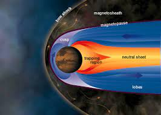
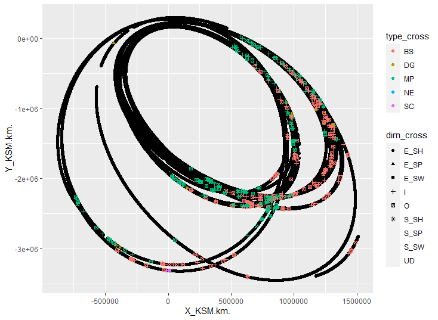

---
output:
  pdf_document:
    number_sections: yes
    fig_caption: yes
  html_document:
    df_print: paged
geometry: left=3.8cm,right=2.5cm,top=2.5cm,bottom=2.5cm
papersize: a4
header-includes: \usepackage{amsmath} \usepackage{pdflscape} \usepackage{caption}
  \usepackage{leading} \usepackage{setspace}
bibliography: bibliography.bib
---
\onehalfspacing

\newpage                  <!-- new page -->
\thispagestyle{empty}

```{r, include=TRUE, echo=FALSE, message=FALSE, warning=FALSE, fig.pos="h!", fig.align="center", out.height="25%"}
  
```

\begin{center}          % <!-- center text -->

\bigskip                % <!-- blank lines -->
\bigskip

\Large
\textbf{DATA SCIENCE AND ANALYTICS DISSERTATION}

\bigskip                % <!-- blank lines -->
\bigskip

\textbf{Classification of bow shock and Magnetopause event positions by using the Magnetic Field properties of Saturn} % <!-- make large text -->

\bigskip                % <!-- blank lines -->
\bigskip

\Large{A thesis submitted in partial fulfillment of the requirement for the \\
degree of M.Sc. in Data Science and Analytics.}

\bigskip                % <!-- blank lines -->
\bigskip

\large{Author:}
\large{Mathews Philip Venattu (20250487)}

\large{Supervisor:}
\large{Dr. Katarina Domijan}

\bigskip                % <!-- blank lines -->
\bigskip

\large{Department of Mathematics and Statistics\\
University: National University of Ireland, Maynooth.\\
Date Submitted: 10th July, 2021}

\end{center}              <!-- end center -->

\newpage 

\thispagestyle{empty}

\begin{center}

\large{Abstract}

\end{center}

\bigskip


Cassini-Huygens Space Research mission was a joint collaboration of NASA, ESA and Italian Space agency to study about the planet Saturn and its system that includes its Rings and Natural Satellites. During its life span of about 20 years the spacecraft orbited the planet Saturn for 13 years and also frequently changed its shape and tilt. Because of this frequent changes in the orbital trajectory of spacecraft, it passed multiple times through the boundaries of Bow shock and Magnetopause at different latitude, longitude and phases of Solar Cycle. In this Project, I have used the Magnetic Field data collected during the year 2005 from MAG (Magnetometer) instrument attached to the spacecraft to develop a classification model for detecting the Magnetopause and bow shock boundaries at Saturn . Magnetometer (MAG)in Cassini recorded the strength and direction of the Magnetic field around the spacecraft while it was orbiting the planet Saturn.Logistic Regression model was used to find significant predictors in different datasets when classifying Bow Shock events and Magnetopause events. A Random forest and Lasso regression model was developed for classifying the different events and analyzed those models based on it accuracy and sensitivity.


\newpage 
\thispagestyle{empty}
\tableofcontents

\newpage
\pagenumbering{arabic}
# List of tables{-}
\renewcommand{\listtablename}{} <!-- removes default section name -->
\listoftables

\newpage
# List of figures{-}
\renewcommand{\listfigurename}{}
\listoffigures

\newpage

# Introduction{#intro}

All planets in our solar system have magnetic field like earth. Some of the planets like Uranus, Saturn, Jupiter, and Neptune have large magnetic field than earth. Magnetosphere of an astronomical object is the area surrounding that object where its Magnetic field is present. Like all other planets Saturn also has the similar magnetosphere structure - it has a Bow shock, Magnetosheath, Magnetopause and Magneto tail. Among this structure bow shock is the point at which the Magnetosphere of the Saturn interacts with the solar wind that in turn suddenly reduces its speed and pressure. Magnetopause is the boundary between Saturn’s Magnetic field and Solar wind. The Magnetosheath exists between the Bow shock and the Magnetopause, an area of shocked solar wind that is significantly influenced by the changes that occur within the Bow shock and whose features can impact the interaction across the Magnetopause. The dynamic pressure of Solar wind usually determines boundary and position of Magnetopause and Bow shock. The Cassini Huygens Mission is a joint NASA/ESA/ASI project to make a detailed survey of the ringed planet Saturn and its natural satellites. Cassini spacecraft recorded magnetic field and plasma condition of the environment during its insertion to Saturn’s orbit by using the Cassini Magnetometer (MAG), Plasma Spectrometer (CAPS). The magnetic field strength pattern clearly shows some “overshoot” and “foot” when the spacecraft passed through the boundaries of Magnetopause, Bow shock and Magnetosheath (@achilleos2007). The Magnetometer (MAG) which continuously acquired magnetic field data that is associated with the Plasma Environment and internal source of Saturn are essential to study about the interaction between solar wind and Magnetosphere of Saturn.

\bigskip                 <!-- blank lines -->
\bigskip
```{r, echo=FALSE, message=FALSE,out.width="60%",out.height="30%",fig.cap="Diagram of Planetary Magnetosphere",  fig.pos="h!", fig.align="center"}
 

```

\bigskip                 <!-- blank lines -->
\bigskip


Figure 1 is a schematic diagram of how Bow shock and Magnetopause boundaries looks like around the planet saturn. Magnetosphere of Saturn act as an obstacle to the Solar wind far away from the planet and the Magnetopause of the planet Saturn lies in 20 Rs (Radius of Saturn=60330 km). So, the Solar wind which interact with the magnetosphere is decelerated by the bow shock and the physical properties of the plasma (@sergis2013). The magneto disk pressure, which inflates the equatorial magnetosphere considerably more than the high-latitude magnetosphere, affects the geometry of the Magnetopause boundary itself, resulting in clear polar flattening (@pilkington2014). In the case of Earth, basic pressure balance is due to the interaction between upstream solar wind flow against magnetic pressure from the magnetosphere and this helps to draw the approximate location of Magnetopause boundary but when it comes to Saturn we must consider the influence of the natural satellite Enceladus, which serves as a huge internal plasma source. The pressure related with the super thermal component of this internally produced plasma serves to inflate the magnetosphere considerably beyond what a basic magnetic pressure calculation would predict (@pilkington2015a). So even in a steady solar wind conditions, due to the internal plasma mentioned above the Magnetopause boundary of Saturn may move significantly. 

Lots of studies were done based on the data acquired from the Cassini Spacecraft instruments. (@sergis2013) they chose intervals between 2004 and 2011 when the spacecraft was travelling through the magnetic sheath and used the data recorded to explore different properties like plasma, energetic particle, magnetic field density, temperature etc. They concentrated more on the presence of W+s ions (water group) and explained the ejection of energetic ions as a function of pitch angle and energy which shows the often flow of heavy energetic ions from bow shock. Analysis of CAPS (Cassini Plasma Spectrometer) by (@burkholder2017) shown the significant ion flow differences prenoon and postnoon, and apart from that magnetic field data was used to illustrate the rotation of IMF (Interplanetary Magnetic Field) vector.

 In this project we are considering the bow shock and Magnetopause crossing of the spacecraft during the year 2005. This report explains about the entire project with different sections like Background, Dataset explanation,	Data Manipulation, Data Visualization, Models trained to classify the type of crossings, R code used, summary of the results and conclusion. Background section explains about the different terms used and current approaches done by others for classification. In Dataset explanation section, it explains about each variable and the different datasets that were used for this project. Data Manipulation section gives a detailed explanation about the transformations and Different models were trained with different derived datatsets to achieve better results. Each models that were used for the classification in this project was explained on the Model Developmnet Section of this report. Remaining portions explains about the code and its results.


\newpage

# Background

In the early days, scientists have very less information regarding the Planet Saturn and its magnetosphere because as we all know that the magnetic fields are invisible, and it needs to be studied from inside. Cassini Huygens mission was a great opportunity for the science world to explore the planet and its behavior. This mission helped to study the magnetic field and the flow of different gases under the influence of the magnetic field which affects the auroras of Saturn. This mission had given some powerful insights about the atmosphere and the surrounding of Planet Saturn. By comparing Saturn with the similar exoplanets will give information regarding the evolution of the Solar System. Different studies were done based on the data gathered from the Cassini spacecraft. Based on this data @sulaiman2017 demonstrated that polar flattening of the Magnetopause causes shorter streamline pathways over the poles, resulting in a higher-pressure gradient, which twists the field. This in turn leads to different conditions at the Magnetopause when compared to those predicated based on axisymmetric assumptions. From 2004 day 299 through 2012 day 151, a substantial data was compiled by @thomsen2018 of Magnetosheath measurements was collected using data from CAPS, MAG, and MIMI. This data collection enables researchers to investigate things like local temporal dependence of Magnetosheath parameters. They also demonstrated a new method for estimating upstream solar wind speed using the same	 Magnetosheath parameters. @pan2017 used the MAG data for research which provides a broad picture of low-frequency waves in Saturn's magnetosphere, which has crucial consequences for how magnetospheric energy leaks.

Both the Bow shock and Magnetopause models can be used as a significant tool which gives insights about the solar upstream conditions and its dynamic pressure at which they are associated. All the data associated with Cassini uses KSM coordinate system and this system is Saturn centered where the x -axis is towards the sun (@masters2013). Orbital tour of Cassini spacecraft around the planet  Saturn was started in the month of July 2004. During that time the spacecraft crossed 100 Bow Shock boundaries. A study done by @pan2017 On 11th and 12th of April 2005, Cassini magnetometer readings were made during a typical sequence of Cassini bow shock crossings. The spacecraft began and finished the period downstream of the shock in the Magnetosheath solar wind, with two trips into the upstream solar wind, each separated by two shock crossings. The presence of obvious shock ramps and a constant upstream field indicates that these are quasi-perpendicular crossings. During this time, the magnetic field strength values that were recorded by the magnetometer was so high. In this report I analysed the magnetometer and position data of Cassini spacecraft during the year 2005 to classify the Magnetopause and Bow Shock events.


\newpage

# Datasets

Cassini Spacecraft orbited around the Saturn for about 9 years. During this period, the spacecraft transmitted valuable information regarding Saturn  like the magnetic field strength, position at which it was measured to earth. Magnetometer and CAPS are the main instruments that were used for measuring the magnetic field strength and Kinetic Energy of particles at each point. For this project, I only considered the data that was recorded during the year 2005 by the spacecraft. Mainly two datasets were used in this project to make a final combined useful dataset, first dataset contains a list of Bow Shock and Magnetopause event crossings that occurred during the year 2005 (@jackman2019). The second dataset contains the information regarding the position of spacecraft and the vector data of Magnetic field strength. 

## Raw Datasets 

### Dataset 1: Magnetopause And Bow shock Crossing List 

This dataset only contains the data of the year 2005 and that was originally developed by compiling two datasets that are posted in the MAPSView webpage (http://mapskp.cesr.fr/BSMP/index.php) which contains the Bow Shock and Magnetopause event crossings between 2004 day 179 and 2007 day 349 (H.J. McAndrews, S.J. Kanani, A. Masters, and J.C. Cutler) through visual identification of CAPS and MAG data. The second list of data has the Magnetopause crossings during the year 2004 to October 2010 and May 2012 to February 2013 (@pilkington2015a). 

This dataset contains seven variables: `year_cross`, `doy_cross`, `doyfr    c_cross`, `hour_cross`, `minute_cross`, `type_cross`, `dirn_cross`, `xcrosslist`, `ycrosslist`, `zcrosslist`

  
```{r, echo=FALSE, message=FALSE , warning=FALSE}
suppressMessages(library(ggplot2))
suppressMessages(library(cowplot))
suppressMessages(library(plotly))
suppressMessages(library(dplyr))
suppressMessages(library(tidyverse))
suppressMessages(library(mgcv))
suppressMessages(library(glmnet))
suppressMessages(library(ranger))
suppressMessages(library(caret))
WD <- getwd()
if (!is.null(WD)) setwd(WD)
raw_data_1<-readRDS('./Data/dataset_version_0/Full_Cassini_Master_MP_BS_CMJ_revised2005.rds', refhook = NULL)

```
<b><u>Variable Description</u></b>

* `year_cross`: It contains a numeric value of the year in which spacecraft crossed the event.
* `doy_cross `: It contains a numeric value of the day on which spacecraft crossed the event.
* `hour_cross`: It contains a numeric value of the hour at which spacecraft crossed the event.
* `minute_cross`: It contains a numeric value of the minute at which spacecraft crossed the event.
*	`doyfrac_cross`:  `doy_cross` + (`hour_cross`*60+`minute_cross`)/(24*60) 
*	`type_cross`: This is a categorical variable contains information about what type of event did the spacecraft crossed. 
    +	**MP**: Magnetopause
    +	**BS**: Bow Shock
    +	**DG**: Data gap
    +	**SC**: SCAS interval which are unreliable data
*	`dirn_cross`:  This is also a Categorical variable that contains information regarding in which direction did the spacecraft moved.The direction categories in this variable are:
    +	**in**: Inbound means the spacecraft is moving towards the planet.
    +	**out**: Outbound means the spacecraft is moving away from the plant.
    +	**S_SW**: Starts with the solar wind is the region at which spacecraft recorded values at the start of solar wind.
    +	**S_SH**: Starts with Magnetosheath is the region at which spacecraft recorded values at the start of Magnetosheath.
    +	**S_SP**: Starts with Magnetosphere is the region at which spacecraft recorded values at the start of magnetosphere.
    +	**E_SW**: Ends with the solar wind is the region at which spacecraft recorded values at the end of solar wind.
    +	**E_SH**: Ends with Magnetosheath is the region at which spacecraft recorded values at end start of Magnetosheath.
    +	**E_SP**: Ends with Magnetosphere is the region at which spacecraft recorded values at the end of magnetosphere.
  
For an inbound the first event that will occur is a Bow Shock and later followed by Magnetopause. But in the case of an outbound direction the first event that occur will be a Magnetopause and later followed by a Bow Shock. Region of sampling at the start of any data gap will have a S_SW, S_SH and S_SP direction type and Region of sampling at the end of data gap E_SW, E_SH and E_SP. Dimension of this dataset is (480,10).

### Dataset 2: Magnetometer Dataset

In this dataset it contains the magnetometer data of Cassini Spacecraft during the year 2005.
Time difference between each data points are one minute which means each data point represents the data of a particular minute. The data in this dataset are provided in the KSM (Kronocentric Solar Magnetospheric) Coordinate system which is a kind of Saturn centered Coordinate system where direction of X is from Saturn to the Sun	and X-Z plane of the Coordinate system contains the Saturn centered axis of Magnetic Dipole ‘M’. 

  
```{r, echo=FALSE, message=FALSE , warning=FALSE}

raw_data_2<-readRDS('./Data/dataset_version_0/Cass_data2005.rds', refhook = NULL)

```

Some of the relevant variables in the dataset are:

* `X_KSM.km.`: This is the X coordinate point value  of the spacecraft in KSM Coordinate System.
*	`Y_KSM.km.`:  This is the Y coordinate point value of the spacecraft in KSM Coordinate System.
*	`Z_KSM.km.`: This is the Z coordinate point value of the spacecraft in KSM Coordinate System.
*	`Timestamp.UTC.` : It is the timestamp  at which data point was recorded by the Magnetometer.
*	`DOY.UTC.` : It tells about the day at which the datapoint was recorded in the year 2005.
*	`BX_KSM.nT.`: It is the x component of magnetic field strength in Amperes/meter.
*	`BY_KSM.nT.`: It is the y component of magnetic field strength in Amperes/meter.
*	`BZ_KSM.nT.`: It is the z component of magnetic field strength in Amperes/meter.
*	` BTotal.nT.` : It is the resultant vector of Bx, By and Bz

\begin{equation}
 	B_{Tot} = \sqrt{Bx^2 + By^2 + Bz^2}
\end{equation}

This dataset contains 494683 rows and 12 columns.

 
## Derived Datasets

This section contains the information regarding all the datasets that were derived from the Raw Datasets.

### Dataset 3: Combined Data Of Dataset 1 And Dataset 2

This is a newly created dataset by merging dataset 1 and dataset 2, so that we can understand the Magnetic field properties during the events like Magnetopause and Bow Shock.  For merging the two datasets, the date and time variables were used as the key because that is common variable in both the dataset. Before joining these dataset it is necessary to format the date in Dataset 1. The `doy_cross` variable was selected and added “2004-12-31” date to that variable. By doing so it will generate a date with respect to the reference date.  In dataset 2 the variable `Timestamp.UTC.` is in string format inorder to convert it into a data format I used `as.POSIXct()` function with `format="%d/%m/%Y %H:%M"`. Later the ` Timestamp.UTC.` variable was converted into a new format which can be used as a key that is similar to the date created in Dataset 1 and which is then stored in the `date` variable. Two new variables were created in the Dataset 2 from the newly created `date` variable known as `hour_cross` and `minute_cross`. The `left_join()` function was used for merging the two datasets by using the variables `date`,`hour_cross` and `minute_cross` which is common on dataset 1 and dataset 2. In the newly created dataset it contains all the variables of dataset 1 and dataset 2. The dimension of the newly created dataset is 494683 rows and 19 columns. Some of the variables are removed from the dataset because we know that dataset 1 has very less number of datapoints when compared to dataset 2 So, it is better remove the variables like `xcrosslist`, `ycrosslist`, `zcrosslist`, `year_cross`, `doy_cross`,`SCET.s.`, `doyfrac_cross`, `hour_cross` and `minute_cross` from the merged dataset. Data manipulations and Visualizations were done on this newly created dataset.

  
```{r, echo=FALSE, message=FALSE , warning=FALSE}
raw_data_3<-readRDS('./Data/dataset_version_0/joined_data.rds', refhook = NULL)
raw_data_4<-readRDS('./Data/dataset_version_2/input_datasetFinal.rds', refhook = NULL)
raw_data_5<-readRDS('./Data/dataset_version_2/Average_SD_Data.rds', refhook = NULL)

```
 After removing some of the variables, now the modified dataset hass 494683 rows and 16 columns.
 
### Dataset 4: Average and Standard Deviation Dataset

This dataset was created after the exploratory  data analysis done on `Dataset 3`. From the results of those analysis Standard deviation and Average value of the Total Magnetic field 15 minutes before and 15 minutes after of an event occurred data point are showing some pattern. `rowMeans()` function from the base package and `rowSds()` function  from the `matrixStats` (@bengtsson2021package) package was used for creating this dataset.


**Some of the Variables are**

* `Avg_Lag_Bx.`: This is the Average of all the `Bx` values that were recorded 15 minutes before each datapoint.
*	`Avg_Lag_By`:  This is the Average of all the `By` values that were recorded 15 minutes before each datapoint.
*	`Avg_Lag_Bz`:  This is the Average of all the `Bz` values that were recorded 15 minutes before each datapoint.
*	`Avg_Lag_BTot`: This is the Average of all the `BTot` values that were recorded 15 minutes before each datapoint .
*	`SD_Lag_Bx.` : This is the Standard Deviation of all the `Bx` values that were recorded 15 minutes before each datapoint.
*	`SD_Lag_By` :This is the Standard Deviation of all the `By` values that were recorded 15 minutes before each datapoint.
*	`SD_Lag_Bz`: This is the Standard Deviation of all the `Bz` values that were recorded 15 minutes before each datapoint.
*	`SD_Lag_BTot.`: This is the Standard Deviation of all the `BTot` values that were recorded 15 minutes before each datapoint.
* `Avg_Lead_Bx.`: This is the Average of all the `Bx` values that were recorded 15 minutes after each datapoint.
*	`Avg_Lead_By`:  This is the Average of all the `By` values that were recorded 15 minutes after each datapoint.
*	`Avg_Lead_Bz`:  This is the Average of all the `Bz` values that were recorded 15 minutes after each datapoint.
*	`Avg_Lead_BTot`: This is the Average of all the `BTot` values that were recorded 15 minutes after each datapoint.
*	`SD_Lead_Bx.` : This is the Standard Deviation of all the `Bx` values that were recorded 15 minutes after each datapoint.
*	`SD_Lead_By` :This is the Standard Deviation of all the `By` values that were recorded 15 minutes after each datapoint.
*	`SD_Lead_Bz`: This is the Standard Deviation of all the `Bz` values that were recorded 15 minutes after each datapoint.
*	`SD_Lead_BTot.`: This is the Standard Deviation of all the `BTot` values that were recorded 15 minutes after each datapoint.
 
\newpage

# Data Manipulation Section

This section will explain about the data manipulation that was done on the merged dataset (Dataset 3). There were lots of NA values in different predictors, so it was important to impute these values before using it for training the models.

## Removing Time Dependency

Since all the datapoints were recorded by the spacecraft using the instruments over time so, there can be a time dependency. To remove the time dependency, I made the dataset wider which means a thirty-minute window was used for each data point and stored the magnetic field strength values and position of the spacecraft at each minute as a column for each row. Now for each data point there are 219 columns. I have labelled each column in the format (predictor_name{minute_index}). For example, the BX_KSM16 represents the BX_KSM value after one minute of the selected datapoint. All time-dependency variables like `Timestamp.UTC.`,`doy_cross`,`time` etc  were removed. 

## Data Imputation

In this dataset there are many NA values in different predictors like `type_cross` and `dirn_cross`. Since `type _cross` and `dirn_cross` are both categorical variables So, it is critical to impute the NA values with relevant short terms. `type_cross` variables represents the type of event at which the spacecraft crossed. Currently `type_cross` variable has values `MP`, `BS`, `DG` and `SCAS` which represents Magnetopause, Bow shock, Data gap and Unreliable data. All the other data than the above-mentioned categories in the newly created dataset can be categorized as `NE` which means No Events Occurred.

For `dirn_cross` variable, which represents the direction at which spacecraft is moving. This variable has the categories E_SH, E_SP, E_SW, I, O, S_SH S_SP and S_SW. So, I have imputed all the datapoints which has NA values in `dirn_cross` as `UD` (Unknown Direction) which means the direction of the spacecraft when that datapoint was recorded is Unknown. 

\newpage

# Exploratory Data Analysis

The dataset contains the records of more than 490000 magnetometer readings with labels of type of crossing, Magnetic filed strength values of fifteen minutes before and after of a datapoint and position of the spacecraft at which the data was recorded. The orbits of the spacecraft covered almost all local hours and gave sufficient dayside coverage. Before getting into further analysis its important to understand whether the data is imbalanced or not.The dataset contains enough datapoints  for training different models. Understanding each variables on data is required before training the Models for classifying the events.  

To understand the inbound and outbound boundary crossings we are going to consider a particular timeframe at which spacecraft crossed all the boundaries. From @jackman2019 It is stated that from 72th day to 74th day of the year 2005 Cassini Spacecraft was in Outbound on the dawn flank. Figure shown below is the Line graph of Total Magnetic Field recorded during the period of 72 to 74th day of the year 2005. In the Figure below the blue dotted line represents the point at which spacecraft crossed Bow Shock boundary and the red dotted line represents the Magnetopause. The package `ggplot` is used for the data exploration in this project. 

```{r, echo=FALSE, message=FALSE, fig.width= 12, fig.height=3,fig.cap="Line Graph of Total Magnetic Field Strength between 72 and 74th day of the year 2005", cache=TRUE}

d1<-as.Date(72,origin="2005-01-01")
d2<-as.Date(73,origin="2005-01-01")
temp<-filter(raw_data_3,between(date,d1,d2))
bowShock<-filter(temp,type_cross=="BS")$TimeStamp
MagP<-filter(temp,type_cross=="MP")$TimeStamp

ggplot(data=temp, aes(x=TimeStamp , y=abs(BTotal.nT.))) +
  geom_line()+
  ylab("|B|(nT)")+
  xlab("Timestamp")+
  geom_vline(xintercept=bowShock, linetype="dotted",colour="blue",size=1.3)+
  geom_vline(xintercept=MagP, linetype="dotted",colour="red",size=1.3)+
  theme(axis.title.x=element_blank(),
        axis.text.x=element_blank(),
        axis.ticks.x=element_blank()) + theme(legend.position = "none") + 
  ggtitle("Magnetic Field Strength between 72 and 74 day in the year 2005 (Outbound) ") +
  xlab("BTot") 
```

From Figure 2, we can clearly see that when the spacecraft approached the Bow Shock boundary there is a large value fluctuation of total magnetic field but when it comes to Magnetopause event there are only small value fluctuations. Since this data was recorded during the Outbound, the first boundary that was crossed by the spacecraft was Magnetopause and later followed by the Bow shock Boundaries.


```{r, echo=FALSE, message=FALSE, fig.width= 12, fig.height=3,fig.cap="Line Graph of Total Magnetic Field Strength between 136 and 138th day of the year 2005"}


d1<-as.Date(136,origin="2005-01-01")
d2<-as.Date(138,origin="2005-01-01")
temp<-filter(raw_data_3,between(date,d1,d2))
bowShock<-filter(temp,type_cross=="BS")$TimeStamp
MagP<-filter(temp,type_cross=="MP")$TimeStamp

ggplot(data=temp, aes(x=TimeStamp , y=abs(BTotal.nT.))) +
  geom_line()+
  ylab("|B|(nT)")+
  xlab("Timestamp")+
  geom_vline(xintercept=bowShock, linetype="dotted",colour="blue",size=1.3)+
  geom_vline(xintercept=MagP, linetype="dotted",colour="red",size=1.3)+
  theme(axis.title.x=element_blank(),
        axis.text.x=element_blank(),
        axis.ticks.x=element_blank())
```

During the Inbound prenoon of Cassini Spacecraft which is between 136th and 138th day of the year 2005, the spacecraft observed some clean bow shock crossings on 136th day and followed by the Magnetopause Crossings on 137th day of the year 2005. Figure Shown below is the Magneticfield data between those days and the events like Bow Shock and Magnetopause are marked with blue and red color respectively.

From  Figure 3, we can clearly see that first boundary crossed by the spacecraft was Bow shock and later followed by the Magnetopause. There are very large fluctuations during when it crossed the Bow Shock boundary but in the case of Magnetopause region the total magnetic field strength was kind of constant.


## Trajectory of Spacecraft

It is crucial to analyze the effect of Positions of Spacecraft in predicting the events based on this dataset, so that we can understand the significance of that variable.

```{r, echo=FALSE, message=FALSE,out.width="60%",out.height="30%",fig.cap="Boundary Crossing points on the Trajectory of Cassini Space craft",  fig.pos="h!", fig.align="center"}
 

```

From the above plot we can clearly say that the Bow Shock events are in the Outermost orbit on which the spacecraft traveled and all the Magnetopause boundary crossings are in the tail of those orbits. Most of the Bow Shock boundary crossing events has high `X_KSM.km.` value which is greater than 500000 when compared to other events. The `Y_KSM.km.` value for Bow Shock events mostly lies in between 0 and \(-2\times10^{-3}\). The plot also gives information about the range of `X_KSM.km.` and `Y_KSM.km.` when 90% of boundary crossing happened which is (\(0, 11\times10^{5}\))  and (\(-2\times10^{6} , 0\)).
 
## Examining the Data Imbalance 

It is always important to check whether the given data is balanced or not. If it is not balanced that means there is a large number of particular class and fewer data points for all other classes of data. This imbalance will makes the model that we wants to train  biased to that set of data. 

\begin{center}
\captionof{table}{Number of Datapoints in each Boundary Class }
\begin{tabular}{|l|l|}
\hline
Event Class & Count\\ \hline
SCAS (unreliable)  & 2 \\ \hline
Data Gap  & 15 \\ \hline
Magnetopause  & 203 \\ \hline
Bow Shock & 245  \\ \hline 
No Events Occurred  & 494127 \\ \hline
Total &  494592   \\ \hline
\end{tabular}
\end{center}

From Table 1, it is clear that 90% of the data points are in the No Events Occurred Class and there are only very few data in the Bow shock and Magnetopause class. So a method must be adopted to prepare the training dataset for model training. Since there are only a very few data points which are in DG and SCAS class we can remove those data points because both classes gives unreliable data.

## Proportion of Direction of Cross in Different Classes

The `dirn_type` variable explains at which direction the spacecraft was moving when it took the measurements. To get more insights on which direction did the most boundary crossings were recorded. 

```{r, echo=FALSE, message=FALSE,,fig.height=4, fig.cap="Proportion of different directions on each Class "}
ggplot(data = raw_data_4) + geom_bar(mapping = aes(x = type_cross, fill=dirn_cross) , position = "fill")
```

From this stacked Bar plot, we can see that 50% of both the Bow Shock and Magnetopause events are recorded during Inbound and remaining 50% during the Outbound of the Spacecraft. But for all No events Occurred class the direction of cross is Unknown. All other directions like starting from Magnetosheath, Starting from solar wind, starting from Magnetosphere etc are in SCAS and Datagap class. All datapoints with SCAS class are unreliable data and SCAS data was recorded during when the spacecraft starts with Magnetosheath and Ends with Solar wind. All the data points that were recorded when spacecraft was in the End of Magnetosheath, Starts with solar wind, End of Magnetosphere, End of Magnetosphere and starts with Magnetosphere are in Data Gap class. Since the direction of cross of all `NE` data points are Unknown or not available therefore the variable `dirn_cross` should not be used for prediction.

\newpage

# Significance of Predictors

Before Model development Significance of each variable must be evaluated, so that we can remove the unnecessary variables which will leads to over fitting of models. To find the significance of variables two Logistic Regression Models were used. Logistic regression Models can be fit to the data by using the maximum likelihood technique. The `family` of the models used was set to `binomial` because we are   
trying to classify two classes.

__Train and Test Dataset__
  
  Since the Dataset is a highly imbalanced one with 90% of the data has the class `No Events Occurred`. It is crucial to train the model with a balanced dataset, so for that we sampled 100 datapoints of each class by using `sample_n()` function for Dataset 4 and 300 `NE` Points were chosen instead of 100 for the model with Dataset 3 because if predictor count is nearly as big as total data points then the linear regression is too flexible and overfits the data.All other datapoints were chosen as Test Dataset for this model.
  
__Standardizing  the Train and Test Dataset__
  
  Standardizing is a techniques used in the Machine Learning. The main aim of Normalization is to make all the numeric columns in the dataset to a common scale.All the numeric variables in the train dataset was Normalized by using the `scale()` function. The standard deviation and mean of each variable of train dataset was stored separately. The test dataset was then Standardized by using the standard deviation and Means that were stored before for each variable. For Standardizing I have used the below formula:

\begin{equation}
 	X^{'} = \frac{(X - \mu)}{\sigma}
\end{equation}

In this formula mu represents the mean and sigma represents the standard deviation of that variable in the train dataset. By standardizing features we are centering the datapoints to zero and making the standard deviation of value 1.


## Logistic Regression Model 1: Bow Shock vs Other Events

In this model I tried to predict the Bow shock events by using different derived datasets. Since the datasets are highly imbalanced, it is important to sample equal number of classes from datasets to train the Logistic Regression model. Before splitting into training and Test Dataset, a new variable called `event_occured` was created and all Bow Shock events were stored as 1 and all the rest of the events as 0 in the `events_occured` variable.


### Results

Models were trained with different derived datasets and later compared the results.Table 2 Shown below contains the information regarding the datasets used and count of variables that are significant which is extracted from the summary of the model. From the results of Models that were trained with different datasets, Table 2 indicates that all the predictor variables are significant.  

\newpage 

\begin{center}
\captionof{table}{Logistic Regression : Bow Shock Vs Other Events Results Table}
\begin{tabular}{|l|l|l|}
\hline
Dataset Used & Significant Predictors & Total Predictors\\ \hline
Dataset 3 & 218  & 218 \\ \hline
Dataset 4 & 25  & 25 \\ \hline
Dataset 3 without Lead Variables & 107 & 107 \\ \hline
\end{tabular}
\end{center}
  

__Summary of Dataset 3__ 

From Dataset 3 we have sampled 300 NE points, 100 Bow shock data points and 100 Magnetopause data points for the train data, because there are 218 predictors in this dataset and if predictor count is nearly as big as total data points then the linear regression is too flexible and overfits the data. The Table 3 shown below is the confusion matrix of Logistic Rgression Model with Dataset 3.

```{r , echo=FALSE, message=FALSE, warning=FALSE}
copy_data<-raw_data_4
t<-copy_data[!(copy_data$type_cross=="DG" | copy_data$type_cross=="SC"),]
copy_data<-t
copy_data$type_cross<-factor(copy_data$type_cross)
copy_data$id<-seq.int(nrow(copy_data))
cassini.train_unscaled<-copy_data%>% filter(type_cross=='NE')%>%sample_n(300) %>%rbind(copy_data%>%filter(type_cross=='BS')%>%sample_n(100))%>%rbind(copy_data%>%filter(type_cross=='MP')%>%sample_n(100))
cassini.train_unscaled$type_cross<-as.factor(cassini.train_unscaled$type_cross)
cassini.test_unscaled<-copy_data[-cassini.train_unscaled$id,]
cassini.test_unscaled<-dplyr::select(cassini.test_unscaled,-id)
cassini.train_unscaled<-dplyr::select(cassini.train_unscaled,-id)
## Scaling the data

cassini.train_scaled<-cassini.train_unscaled%>%mutate_if(is.numeric,scale)
means <- lapply(dplyr::select(cassini.train_unscaled,-c(type_cross,dirn_cross)), mean)
sds <- lapply(dplyr::select(cassini.train_unscaled,-c(type_cross,dirn_cross)), sd)
means <- matrix(unlist(means), ncol = 217, byrow = FALSE)
sds <- matrix(unlist(sds), ncol = 217, byrow = FALSE)

## Normalizing the TEST DATASET
cassini.test_scaled<-dplyr::select(cassini.test_unscaled,-c(type_cross,dirn_cross))

for(col in c(1:dim(cassini.test_scaled)[2])){
  temp<-(cassini.test_scaled[,col]-means[1,col])/sds[1,col]
  cassini.test_scaled[,col]<-as.matrix(temp)
  temp<-NULL
}
cassini.test_scaled$type_cross<-cassini.test_unscaled$type_cross
cassini.test_scaled$dirn_cross<-cassini.test_unscaled$dirn_cross

## Logistic Regression Model 1

### BS as 1 and all other events as 0

## Removing dirn_cross and creating new variable `new_trainData`.

new_trainData<-dplyr::select(cassini.train_scaled,-dirn_cross)
new_testData<-dplyr::select(cassini.test_scaled,-c(dirn_cross))

#### Training Data

cassini.logTrain<-new_trainData%>%mutate(event_occured=ifelse(type_cross=='NE'|type_cross=='MP',0,1))
cassini.logTrain$event_occured<-as.factor(cassini.logTrain$event_occured)
cassini.logTrain <- dplyr::select(cassini.logTrain,-c(type_cross))

#### Test Data

cassini.logTest<-new_testData%>%mutate(event_occured=ifelse(type_cross=='NE'|type_cross=='MP',0,1))
cassini.logTest$event_occured<-as.factor(cassini.logTest$event_occured)
cassini.logTest <- dplyr::select(cassini.logTest,-c(type_cross))

#### Model 1 Training and Confusion Matrix

LOGModel1<- glm(event_occured ~ ., family = "binomial", data = cassini.logTrain)
cassini.logTest$prob=predict(LOGModel1,cassini.logTest,type="response")
cassini.logTest$pred <- factor(ifelse(cassini.logTest$prob < .8, 0,1))
conf_mat_log1<-confusionMatrix(cassini.logTest$pred, cassini.logTest$event_occured,positive='1')
conf_mat_log1$table
```

\begin{center}
\captionof{table}{Logistic Regression - Bow Shock Vs Other Events Results Table (Dataset 3)}
\begin{tabular}{|l|l|l|l|l|}
\hline
Accuracy & Sensitivity & Specificity & Pos Pred Rate & Neg Pred Rate\\ \hline
`r round(conf_mat_log1$overall['Accuracy']*100,1)` & `r round(conf_mat_log1$byClass['Sensitivity']*100,1)`  & `r round(conf_mat_log1$byClass['Specificity']*100,1)` & `r round(conf_mat_log1$byClass['Pos Pred Value']*100,3)` & `r round(conf_mat_log1$byClass['Neg Pred Value']*100,1)` \\ \hline
\end{tabular}
\end{center}


From the Table 3, we can clearly see that the accuracy is about `r round(conf_mat_log1$overall['Accuracy']*100,1)`% . Eventhough it gives better accuracy, the sensitivity of the Model is very low. Accuracy is the percentage of datapoints that are classified correctly but in the case of the Sensitivity which is number of true positive predictions divided by the total number of positive predicitions in this model. The sensitivity gives a value that explains about Bow Shock events that are correctly classified.   `r round(conf_mat_log1$byClass['Sensitivity'] * 100,1)` is the sensitivity of the above model,so, `r round(conf_mat_log1$byClass['Sensitivity'] * 100,1)` out of 100 Bow Shock events were classified correctly through this model. So, we can say that this Logistic Regression model is not a good one.
 

__Summary of Dataset 4 : Average and Standard Deviation Data__ 

In the case of this dataset there are only 24 predictors, so the train dataset contains 100 NE points, 100 BS Points and 100 MP points which was sampled from the Dataset 4. The Table 4 shown below is the Confusion matrix of the model with this dataset.

```{r , echo=FALSE, message=FALSE,warning=FALSE}

data_avg<-readRDS("./Data/dataset_version_2/Average_SD_Data.rds", refhook = NULL)
copy_data<-data_avg
t<-copy_data[!(copy_data$type_cross=="DG" | copy_data$type_cross=="SC"),]
copy_data<-t
copy_data$type_cross<-factor(copy_data$type_cross)
copy_data$id<-seq.int(nrow(copy_data))

cassini.train_unscaled<-copy_data%>% filter(type_cross=='NE')%>%sample_n(100) %>%rbind(copy_data%>%filter(type_cross=='BS')%>%sample_n(100))%>%rbind(copy_data%>%filter(type_cross=='MP')%>%sample_n(100))
cassini.train_unscaled$type_cross<-as.factor(cassini.train_unscaled$type_cross)
cassini.test_unscaled<-copy_data[-cassini.train_unscaled$id,]
cassini.test_unscaled<-dplyr::select(cassini.test_unscaled,-id)
cassini.train_unscaled<-dplyr::select(cassini.train_unscaled,-id)
## Scaling the data

cassini.train_scaled<-cassini.train_unscaled%>%mutate_if(is.numeric,scale)
means <- lapply(dplyr::select(cassini.train_unscaled,-c(type_cross,dirn_cross)), mean)
sds <- lapply(dplyr::select(cassini.train_unscaled,-c(type_cross,dirn_cross)), sd)
means <- matrix(unlist(means), ncol = 23, byrow = FALSE)
sds <- matrix(unlist(sds), ncol = 23, byrow = FALSE)


## Normalizing the TEST DATASET


cassini.test_scaled<-dplyr::select(cassini.test_unscaled,-c(type_cross,dirn_cross))

for(col in c(1:dim(cassini.test_scaled)[2])){
  temp<-(cassini.test_scaled[,col]-means[1,col])/sds[1,col]
  cassini.test_scaled[,col]<-as.matrix(temp)
  temp<-NULL
}
cassini.test_scaled$type_cross<-cassini.test_unscaled$type_cross
cassini.test_scaled$dirn_cross<-cassini.test_unscaled$dirn_cross


## Logistic Regression Model 1 (Average)


new_trainData<-cassini.train_scaled
new_testData<-cassini.test_scaled

### BS as 1 and all other events as 0

## Removing dirn_cross and creating new variable `new_trainData`.

#### Training Data

cassini.logTrain<-new_trainData%>%mutate(event_occured=ifelse(type_cross=='NE'|type_cross=='MP',0,1))
cassini.logTrain$event_occured<-as.factor(cassini.logTrain$event_occured)
cassini.logTrain <- dplyr::select(cassini.logTrain,-c(type_cross))

#### Test Data

cassini.logTest<-new_testData%>%mutate(event_occured=ifelse(type_cross=='NE'|type_cross=='MP',0,1))
cassini.logTest$event_occured<-as.factor(cassini.logTest$event_occured)
cassini.logTest <- dplyr::select(cassini.logTest,-c(type_cross))

#### Model 1 Training and Confusion Matrix

LOGModel2<- glm(event_occured ~ ., family = "binomial", data = cassini.logTrain)
cassini.logTest$prob=predict(LOGModel2,cassini.logTest,type="response")
cassini.logTest$pred <- factor(ifelse(cassini.logTest$prob < .8, 0,1))
conf_mat_log2<-confusionMatrix(cassini.logTest$pred, cassini.logTest$event_occured,positive='1')
conf_mat_log2$table
```
\begin{center}
\captionof{table}{Logistic Regression : Bow Shock Vs Other Events Results Table (Dataset 4)}
\begin{tabular}{|l|l|l|l|l|}
\hline
Accuracy & Sensitivity & Specificity & Pos Pred Rate & Neg Pred Rate\\ \hline
`r round(conf_mat_log2$overall['Accuracy']*100,1)` & `r round(conf_mat_log2$byClass['Sensitivity']*100,1)`  & `r round(conf_mat_log2$byClass['Specificity']*100,1)` & `r round(conf_mat_log2$byClass['Pos Pred Value']*100,3)` & `r round(conf_mat_log2$byClass['Neg Pred Value']*100,1)` \\ \hline
\end{tabular}
\end{center}

From Table 4, we can clearly see that the accuracy is about `r round(conf_mat_log2$overall['Accuracy']*100,1)`% . Eventhough it gives better accuracy than the Model with Dataset 3 but still the sensitivity of the Model is similar to that of the Dataset 3 Logistic Regression Model. `r round(conf_mat_log2$byClass['Sensitivity']*100,1)`% of the Bow Shock boundaries were classified correctly. But when compared to Model that was trained with Dataset 3, The `NE` points were classified more accurately in this model.The specificity of this model is `r round(conf_mat_log2$byClass['Specificity']*100,1)`% which means the `r round(conf_mat_log2$byClass['Specificity']*100,1)`% of the NE Points were classified correctly through this model.


__Summary of Dataset 3 : Without Lead Variables__ 

In this dataset there are only 107 predictors which means half of the variables were removed so, the train dataset contains 100 NE points, 100 BS Points and 100 MP points which was sampled from the Dataset 4. The table Shown below is the Confusion matrix of the model with this dataset. Without LEad variable means all the columns which contains the magnetic field information after 15 minutes of a particular datapoint.

```{r , echo=FALSE, message=FALSE,warning=FALSE}
copy_data<-raw_data_4[,1:107]
t<-copy_data[!(copy_data$type_cross=="DG" | copy_data$type_cross=="SC"),]
copy_data<-t
copy_data$type_cross<-factor(copy_data$type_cross)
copy_data$id<-seq.int(nrow(copy_data))

cassini.train_unscaled<-copy_data%>% filter(type_cross=='NE')%>%sample_n(100) %>%rbind(copy_data%>%filter(type_cross=='BS')%>%sample_n(100))%>%rbind(copy_data%>%filter(type_cross=='MP')%>%sample_n(100))
cassini.train_unscaled$type_cross<-as.factor(cassini.train_unscaled$type_cross)
cassini.test_unscaled<-copy_data[-cassini.train_unscaled$id,]
cassini.test_unscaled<-dplyr::select(cassini.test_unscaled,-id)
cassini.train_unscaled<-dplyr::select(cassini.train_unscaled,-id)
## Scaling the data

cassini.train_scaled<-cassini.train_unscaled%>%mutate_if(is.numeric,scale)
means <- lapply(dplyr::select(cassini.train_unscaled,-c(type_cross,dirn_cross)), mean)
sds <- lapply(dplyr::select(cassini.train_unscaled,-c(type_cross,dirn_cross)), sd)
means <- matrix(unlist(means), ncol = 107, byrow = FALSE)
sds <- matrix(unlist(sds), ncol = 107, byrow = FALSE)


## Normalizing the TEST DATASET


cassini.test_scaled<-dplyr::select(cassini.test_unscaled,-c(type_cross,dirn_cross))

for(col in c(1:dim(cassini.test_scaled)[2])){
  temp<-(cassini.test_scaled[,col]-means[1,col])/sds[1,col]
  cassini.test_scaled[,col]<-as.matrix(temp)
  temp<-NULL
}
cassini.test_scaled$type_cross<-cassini.test_unscaled$type_cross
cassini.test_scaled$dirn_cross<-cassini.test_unscaled$dirn_cross


## Logistic Regression Model 1 (Average)


new_trainData<-cassini.train_scaled
new_testData<-cassini.test_scaled

### BS as 1 and all other events as 0

## Removing dirn_cross and creating new variable `new_trainData`.

#### Training Data

cassini.logTrain<-new_trainData%>%mutate(event_occured=ifelse(type_cross=='NE'|type_cross=='MP',0,1))
cassini.logTrain$event_occured<-as.factor(cassini.logTrain$event_occured)
cassini.logTrain <- dplyr::select(cassini.logTrain,-c(type_cross))

#### Test Data

cassini.logTest<-new_testData%>%mutate(event_occured=ifelse(type_cross=='NE'|type_cross=='MP',0,1))
cassini.logTest$event_occured<-as.factor(cassini.logTest$event_occured)
cassini.logTest <- dplyr::select(cassini.logTest,-c(type_cross))

#### Model 1 Training and Confusion Matrix

LOGModel2<- glm(event_occured ~ ., family = "binomial", data = cassini.logTrain)
cassini.logTest$prob=predict(LOGModel2,cassini.logTest,type="response")
cassini.logTest$pred <- factor(ifelse(cassini.logTest$prob < .8, 0,1))
conf_mat_log3<-confusionMatrix(cassini.logTest$pred, cassini.logTest$event_occured,positive='1')
conf_mat_log3$table
```
\begin{center}
\captionof{table}{Logistic Regression : Bow Shock Vs Other Events Results Table (Dataset 3 without Lead variables)}
\begin{tabular}{|l|l|l|l|l|}
\hline
Accuracy & Sensitivity & Specificity & Pos Pred Rate & Neg Pred Rate\\ \hline
`r round(conf_mat_log2$overall['Accuracy']*100,1)` & `r round(conf_mat_log3$byClass['Sensitivity']*100,1)`  & `r round(conf_mat_log3$byClass['Specificity']*100,1)` & `r round(conf_mat_log3$byClass['Pos Pred Value']*100,3)` & `r round(conf_mat_log3$byClass['Neg Pred Value']*100,1)` \\ \hline
\end{tabular}
\end{center}

From Table 5, we can clearly see that the accuracy is about `r round(conf_mat_log3$overall['Accuracy']*100,1)`% . It gives better accuracy and sensitivity than the Model with the Dataset 3 Logistic Regression Model. `r round(conf_mat_log3$byClass['Sensitivity']*100,1)`% of the Bow Shock boundaries were classified correctly. But when compared to Model that was trained with Dataset 3, All other Classes except Bow Shock  were classified more accurately in this model.The specificity of this model is `r round(conf_mat_log3$byClass['Specificity']*100,1)`% which means the `r round(conf_mat_log3$byClass['Specificity']*100,1)`% of the NE Points were classified correctly through this model.

## Logistic Regression Model 2: Magnetopause vs Other Events

Unlike the previous model which classifies Bow Shock events and All other Events, This model classify Magnetopause and all other events by using different derived datasets. Since the datasets are highly imbalanced It is important to sample equal number of classes from datasets to train the Logistic Regression model. Before splitting into training and Test Dataset, A new variable called `event_occured` was created and all Magnetopause events were stored as 1 and all the rest of the events as 0 in that newly created variable.

### Results

Models were trained with different derived datasets and later compared the results.Table 6 contains the information regarding the datasets used and count of Variables that are significant. A brief summary of models trained with different dataset was explained in the coming pages.

\begin{center}
\captionof{table}{Logistic Regression : Magnetopause Vs Other Events Results Table}
\begin{tabular}{|l|l|l|}
\hline
Dataset Used & Significant Predictors & Total Predictors\\ \hline
Dataset 3 & 218  & 218 \\ \hline
Dataset 4 & 25  & 25 \\ \hline
Dataset 3 without Lead Variables & 107 & 107 \\ \hline
\end{tabular}
\end{center}


__Summary of Dataset 3__ 

From Dataset 3  I have sampled 300 NE points, 100 Bow shock data points and 100 Magnetopause Data points for the train data because there are 218 predictors in this dataset and If predictor count is nearly as big as total data points then the linear regression is too flexible and overfits the data.The Table shown below is the confusion matrix.

```{r , echo=FALSE, message=FALSE, warning=FALSE}
copy_data<-raw_data_4
t<-copy_data[!(copy_data$type_cross=="DG" | copy_data$type_cross=="SC"),]
copy_data<-t
copy_data$type_cross<-factor(copy_data$type_cross)
copy_data$id<-seq.int(nrow(copy_data))


cassini.train_unscaled<-copy_data%>% filter(type_cross=='NE')%>%sample_n(300) %>%rbind(copy_data%>%filter(type_cross=='BS')%>%sample_n(100))%>%rbind(copy_data%>%filter(type_cross=='MP')%>%sample_n(100))

cassini.train_unscaled$type_cross<-as.factor(cassini.train_unscaled$type_cross)
cassini.test_unscaled<-copy_data[-cassini.train_unscaled$id,]
cassini.test_unscaled<-dplyr::select(cassini.test_unscaled,-id)
cassini.train_unscaled<-dplyr::select(cassini.train_unscaled,-id)


## Scaling the data

cassini.train_scaled<-cassini.train_unscaled%>%mutate_if(is.numeric,scale)
means <- lapply(dplyr::select(cassini.train_unscaled,-c(type_cross,dirn_cross)), mean)
sds <- lapply(dplyr::select(cassini.train_unscaled,-c(type_cross,dirn_cross)), sd)
means <- matrix(unlist(means), ncol = 217, byrow = FALSE)
sds <- matrix(unlist(sds), ncol = 217, byrow = FALSE)


## Normalizing the TEST DATASET


cassini.test_scaled<-dplyr::select(cassini.test_unscaled,-c(type_cross,dirn_cross))

for(col in c(1:dim(cassini.test_scaled)[2])){
  temp<-(cassini.test_scaled[,col]-means[1,col])/sds[1,col]
  cassini.test_scaled[,col]<-as.matrix(temp)
  temp<-NULL
}
cassini.test_scaled$type_cross<-cassini.test_unscaled$type_cross
cassini.test_scaled$dirn_cross<-cassini.test_unscaled$dirn_cross


## Logistic Regression Model 1

### BS as 1 and all other events as 0

## Removing dirn_cross and creating new variable `new_trainData`.

new_trainData<-dplyr::select(cassini.train_scaled,-dirn_cross)
new_testData<-dplyr::select(cassini.test_scaled,-c(dirn_cross))

#### Training Data

cassini.logTrain<-new_trainData%>%mutate(event_occured=ifelse(type_cross=='NE'|type_cross=='BS',0,1))
cassini.logTrain$event_occured<-as.factor(cassini.logTrain$event_occured)
cassini.logTrain <- dplyr::select(cassini.logTrain,-c(type_cross))

#### Test Data

cassini.logTest<-new_testData%>%mutate(event_occured=ifelse(type_cross=='NE'|type_cross=='BS',0,1))
cassini.logTest$event_occured<-as.factor(cassini.logTest$event_occured)
cassini.logTest <- dplyr::select(cassini.logTest,-c(type_cross))


#### Model 1 Training and Confusion Matrix

LOGModel1<- glm(event_occured ~ ., family = "binomial", data = cassini.logTrain)
cassini.logTest$prob=predict(LOGModel1,cassini.logTest,type="response")
cassini.logTest$pred <- factor(ifelse(cassini.logTest$prob < .8, 0,1))
conf_mat_log4<-confusionMatrix(cassini.logTest$pred, cassini.logTest$event_occured,positive='1')
conf_mat_log4$table

```

\begin{center}
\captionof{table}{Logistic Regression : Magneto Pause Vs Other Events Results Table (Dataset 3)}
\begin{tabular}{|l|l|l|l|l|}
\hline
Accuracy & Sensitivity & Specificity & Pos Pred Rate & Neg Pred Rate\\ \hline
`r round(conf_mat_log4$overall['Accuracy']*100,1)` & `r round(conf_mat_log4$byClass['Sensitivity']*100,1)`  & `r round(conf_mat_log4$byClass['Specificity']*100,1)` & `r round(conf_mat_log4$byClass['Pos Pred Value']*100,3)` & `r round(conf_mat_log4$byClass['Neg Pred Value']*100,1)` \\ \hline
\end{tabular}
\end{center}

From Table 7, we can clearly see that the accuracy is about `r round(conf_mat_log4$overall['Accuracy']*100,1)`% . Eventhough it gives a better accuracy value the sensitivity of the Model is very low. Accuracy is the percentage of datapoints that are classified correctly but in the case of the Sensitivity which is number of exact positive predictions divided by the total number of positive in this model the sensitivity gives a value that explains about Bow Shock events that are correctly classified .   `r round(conf_mat_log4$byClass['Sensitivity'] * 100,1)`% is the sensitivity of the above model So, `r round(conf_mat_log4$byClass['Sensitivity'] * 100)` out of 100 Bow Shock events were classified correctly through this model. When Comparing with the Logistic Regression Model that was used for Classifying the Bow Shock and Rest of the Events, this Logistic regression model was able to classify the Magnetopause events more efficiently by using Dataset 3.
 


__Summary of Dataset 4 : Average and Standard Deviation Data__ 

In the case of this dataset there are only 24 predictors so,  100 NE points, 100 BS Points and 100 MP points were sampled  from the Dataset 4. The table Shown below is the Confusion matrix of the model with this dataset.

```{r , echo=FALSE, message=FALSE,warning=FALSE}

data_avg<-readRDS("./Data/dataset_version_2/Average_SD_Data.rds", refhook = NULL)
copy_data<-data_avg
t<-copy_data[!(copy_data$type_cross=="DG" | copy_data$type_cross=="SC"),]
copy_data<-t
copy_data$type_cross<-factor(copy_data$type_cross)
copy_data$id<-seq.int(nrow(copy_data))

cassini.train_unscaled<-copy_data%>% filter(type_cross=='NE')%>%sample_n(100) %>%rbind(copy_data%>%filter(type_cross=='BS')%>%sample_n(100))%>%rbind(copy_data%>%filter(type_cross=='MP')%>%sample_n(100))

cassini.train_unscaled$type_cross<-as.factor(cassini.train_unscaled$type_cross)
cassini.test_unscaled<-copy_data[-cassini.train_unscaled$id,]
cassini.test_unscaled<-dplyr::select(cassini.test_unscaled,-id)
cassini.train_unscaled<-dplyr::select(cassini.train_unscaled,-id)
## Scaling the data

cassini.train_scaled<-cassini.train_unscaled%>%mutate_if(is.numeric,scale)
means <- lapply(dplyr::select(cassini.train_unscaled,-c(type_cross,dirn_cross)), mean)
sds <- lapply(dplyr::select(cassini.train_unscaled,-c(type_cross,dirn_cross)), sd)
means <- matrix(unlist(means), ncol = 23, byrow = FALSE)
sds <- matrix(unlist(sds), ncol = 23, byrow = FALSE)


## Normalizing the TEST DATASET


cassini.test_scaled<-dplyr::select(cassini.test_unscaled,-c(type_cross,dirn_cross))

for(col in c(1:dim(cassini.test_scaled)[2])){
  temp<-(cassini.test_scaled[,col]-means[1,col])/sds[1,col]
  cassini.test_scaled[,col]<-as.matrix(temp)
  temp<-NULL
}
cassini.test_scaled$type_cross<-cassini.test_unscaled$type_cross
cassini.test_scaled$dirn_cross<-cassini.test_unscaled$dirn_cross


## Logistic Regression Model 1 (Average)


new_trainData<-cassini.train_scaled
new_testData<-cassini.test_scaled

### MP as 1 and all other events as 0

## Removing dirn_cross and creating new variable `new_trainData`.

#### Training Data

cassini.logTrain<-new_trainData%>%mutate(event_occured=ifelse(type_cross=='NE'|type_cross=='BS',0,1))
cassini.logTrain$event_occured<-as.factor(cassini.logTrain$event_occured)
cassini.logTrain <- dplyr::select(cassini.logTrain,-c(type_cross))

#### Test Data

cassini.logTest<-new_testData%>%mutate(event_occured=ifelse(type_cross=='NE'|type_cross=='BS',0,1))
cassini.logTest$event_occured<-as.factor(cassini.logTest$event_occured)
cassini.logTest <- dplyr::select(cassini.logTest,-c(type_cross))

#### Model 1 Training and Confusion Matrix

LOGModel2<- glm(event_occured ~ ., family = "binomial", data = cassini.logTrain)
cassini.logTest$prob=predict(LOGModel2,cassini.logTest,type="response")
cassini.logTest$pred <- factor(ifelse(cassini.logTest$prob < .8, 0,1))
conf_mat_log5<-confusionMatrix(cassini.logTest$pred, cassini.logTest$event_occured,positive='1')
conf_mat_log5$table
```
\begin{center}
\captionof{table}{Logistic Regression : Magneto Pause Vs Other Events Results Table (Dataset 4)}
\begin{tabular}{|l|l|l|l|l|}
\hline
Accuracy & Sensitivity & Specificity & Pos Pred Rate & Neg Pred Rate\\ \hline
`r round(conf_mat_log5$overall['Accuracy']*100,1)` & `r round(conf_mat_log5$byClass['Sensitivity']*100,1)`  & `r round(conf_mat_log5$byClass['Specificity']*100,1)` & `r round(conf_mat_log5$byClass['Pos Pred Value']*100,3)` & `r round(conf_mat_log5$byClass['Neg Pred Value']*100,1)` \\ \hline
\end{tabular}
\end{center}
From Table 8, we can clearly see that the accuracy is about `r round(conf_mat_log5$overall['Accuracy']*100,1)`% . Eventhough it gives better accuracy than the Model above with Dataset 3 but still the sensitivity of the Model is similar to that of  Logistic Regression Model which classifies Magnetopause Events by using the Dataset3.  `r round(conf_mat_log5$byClass['Sensitivity']*100,1)`% of the Bow Shock boundaries were classified correctly. But when compared to Model that was trained with Dataset 3, The `NE` points were classified more accurately in this model.The specificity of this model is `r round(conf_mat_log5$byClass['Specificity']*100,1)`% which means the `r round(conf_mat_log5$byClass['Specificity']*100,1)`% of the NE Points were classified correctly through this model.


__Summary of Dataset 3 : Without Lead Variables__ 

In this dataset there are only 107 predictors which means half of the variables were removed so, the train dataset contains 100 NE points, 100 BS Points and 100 MP points from the Dataset 4. The table Shown below is the Confusion matrix of the model with this dataset.

```{r , echo=FALSE, message=FALSE,warning=FALSE}


copy_data<-raw_data_4[,1:107]
t<-copy_data[!(copy_data$type_cross=="DG" | copy_data$type_cross=="SC"),]
copy_data<-t
copy_data$type_cross<-factor(copy_data$type_cross)
copy_data$id<-seq.int(nrow(copy_data))

cassini.train_unscaled<-copy_data%>% filter(type_cross=='NE')%>%sample_n(100) %>%rbind(copy_data%>%filter(type_cross=='BS')%>%sample_n(100))%>%rbind(copy_data%>%filter(type_cross=='MP')%>%sample_n(100))

cassini.train_unscaled$type_cross<-as.factor(cassini.train_unscaled$type_cross)
cassini.test_unscaled<-copy_data[-cassini.train_unscaled$id,]
cassini.test_unscaled<-dplyr::select(cassini.test_unscaled,-id)
cassini.train_unscaled<-dplyr::select(cassini.train_unscaled,-id)
## Scaling the data

cassini.train_scaled<-cassini.train_unscaled%>%mutate_if(is.numeric,scale)
means <- lapply(dplyr::select(cassini.train_unscaled,-c(type_cross,dirn_cross)), mean)
sds <- lapply(dplyr::select(cassini.train_unscaled,-c(type_cross,dirn_cross)), sd)
means <- matrix(unlist(means), ncol = 107, byrow = FALSE)
sds <- matrix(unlist(sds), ncol = 107, byrow = FALSE)


## Normalizing the TEST DATASET


cassini.test_scaled<-dplyr::select(cassini.test_unscaled,-c(type_cross,dirn_cross))

for(col in c(1:dim(cassini.test_scaled)[2])){
  temp<-(cassini.test_scaled[,col]-means[1,col])/sds[1,col]
  cassini.test_scaled[,col]<-as.matrix(temp)
  temp<-NULL
}
cassini.test_scaled$type_cross<-cassini.test_unscaled$type_cross
cassini.test_scaled$dirn_cross<-cassini.test_unscaled$dirn_cross


## Logistic Regression Model 1 (Average)


new_trainData<-cassini.train_scaled
new_testData<-cassini.test_scaled

### BS as 1 and all other events as 0

## Removing dirn_cross and creating new variable `new_trainData`.

#### Training Data

cassini.logTrain<-new_trainData%>%mutate(event_occured=ifelse(type_cross=='NE'|type_cross=='BS',0,1))
cassini.logTrain$event_occured<-as.factor(cassini.logTrain$event_occured)
cassini.logTrain <- dplyr::select(cassini.logTrain,-c(type_cross))

#### Test Data

cassini.logTest<-new_testData%>%mutate(event_occured=ifelse(type_cross=='NE'|type_cross=='BS',0,1))
cassini.logTest$event_occured<-as.factor(cassini.logTest$event_occured)
cassini.logTest <- dplyr::select(cassini.logTest,-c(type_cross))

#### Model 1 Training and Confusion Matrix

LOGModel2<- glm(event_occured ~ ., family = "binomial", data = cassini.logTrain)
cassini.logTest$prob=predict(LOGModel2,cassini.logTest,type="response")
cassini.logTest$pred <- factor(ifelse(cassini.logTest$prob < .8, 0,1))
conf_mat_log6<-confusionMatrix(cassini.logTest$pred, cassini.logTest$event_occured,positive='1')
conf_mat_log6$table
```

\begin{center}
\captionof{table}{Logistic Regression : Magneto Pause Vs Other Events Results Table (Dataset 3 without Lead Variables)}
\begin{tabular}{|l|l|l|l|l|}
\hline
Accuracy & Sensitivity & Specificity & Pos Pred Rate & Neg Pred Rate\\ \hline
`r round(conf_mat_log6$overall['Accuracy']*100,1)` & `r round(conf_mat_log6$byClass['Sensitivity']*100,1)`  & `r round(conf_mat_log6$byClass['Specificity']*100,1)` & `r round(conf_mat_log6$byClass['Pos Pred Value']*100,3)` & `r round(conf_mat_log6$byClass['Neg Pred Value']*100,1)` \\ \hline
\end{tabular}
\end{center}


From Table 9, we can clearly see that the accuracy is about `r round(conf_mat_log6$overall['Accuracy']*100,1)`% . It gives better accuracy and sensitivity than the Model with the Dataset 3 Logistic Regression Model. `r round(conf_mat_log6$byClass['Sensitivity']*100,1)`% of the Bow Shock boundaries were classified correctly. But when compared to Model that was trained with Dataset 3, All other Classes except Bow Shock  were classified more accurately in this model.The specificity of this model is `r round(conf_mat_log6$byClass['Specificity']*100,1)`% which means the `r round(conf_mat_log6$byClass['Specificity']*100,1)`% of the NE Points were classified correctly through this model.

## Conclusion

Based on summary table of each model that was trained with different datasets we can say that all the variables are significant. Table 10 shown below explains the overall results obtained from different models.

\begin{center}
\captionof{table}{Overall Results: Significance of Predictors}
\begin{tabular}{|l|l|l|l|l|l|}
\hline
Model Used & Dataset Used & Significant Predictors & Accuracy & Sensitivity\\ \hline
LR Model 1 & Dataset 3 & 218   & `r round(conf_mat_log1$overall['Accuracy']*100,1)` & `r round(conf_mat_log1$byClass['Sensitivity']*100,1)` \\ \hline
LR Model 1 & Dataset 4 & 25   & `r round(conf_mat_log2$overall['Accuracy']*100,1)` & `r round(conf_mat_log2$byClass['Sensitivity']*100,1)`\\ \hline
LR Model 1 & Dataset 3 without Lead Variables & 107  & `r round(conf_mat_log3$overall['Accuracy']*100,1)` &`r round(conf_mat_log3$byClass['Sensitivity']*100,1)` \\ \hline
LR Model 2 & Dataset 3 & 218   & `r round(conf_mat_log4$overall['Accuracy']*100,1)` & `r round(conf_mat_log4$byClass['Sensitivity']*100,1)` \\ \hline
LR Model 2 & Dataset 4 & 25   & `r round(conf_mat_log5$overall['Accuracy']*100,1)` & `r round(conf_mat_log5$byClass['Sensitivity']*100,1)`\\ \hline
LR Model 2 & Dataset 3 without Lead Variables & 107  & `r round(conf_mat_log6$overall['Accuracy']*100,1)` &`r round(conf_mat_log6$byClass['Sensitivity']*100,1)` \\ \hline
\end{tabular}
\end{center}


In Table 10 , LR Model 1 represents the Logistic Regression Model that classifies Bow Shock Events from all other events and LR Model 2 represents the Logistic Regression Model that classifies Magneto Pause events from all other events. From the table we can conclude that the Models that were trained with Dataset 4 and Dataset 3 (without Lead Variables) performed better.
\newpage

# Classification Model Development

This section explains about the Model that was Developed for the classification of different Boundaries based on the Magnetometer data and the analysis that were done before. In the Predictor Significance section we found that Dataset 4(Average Dataset) and Dataset 3(without lEad variables) performed better when compared to the other datasets. In this section we will compare the results of Models trained with different datasets and conclude which model can be used to address the problem statement. The model with high sensitivity value and accuracy will be considered as the Best Model. Because sensitivity value of each class will tell us the percentage of each class that was correctly classified. Several Methods can be used for classifying the boundaries by using these kind of datasets, but in this project we are going to use Random forest model and Lasso regression Model.

## Random Forest Model 

This section explains about the three Random forest Models that were trained by using three different datasets.   Random Forest Model is a Supervised Learning algorithm where it builds an ensemble of decision trees. Random forest produces great results by handling large datasets with higher dimensionality. Additional randomness will be added to the model by the random Forest algorithm, while growing the trees. It looks for the best predictor among a random set of predictors which will generally  results in a better model.  

### Setting up Random Forest Model

In this project i have used the `ranger` (@wright2018package) package because it provides a faster implementation of random forest and also easy to tune the hyper parameters.Here the model uses following configuration:

*   `num.trees` was set to 500. `num_trees` will determine how many trees the algorithm builds before it takes the voting or averages of the prediction. Higher the number of trees will usually gives better performance but makes the computation a lot slower.
*   `verbose` which shows the computation status and Estimated runtime was set to TRUE
*   `importance`  was set to `impurity` which will give the variable importance. impurity measures the Gini Index for the classification. 


### Train and Test Dataset
  
  Like we discussed in Section 5 the dataset is a highly imbalanced one with 90% of the data has the class `No Events Occurred`. It is important to train the model with a balanced dataset so, for that we sampled 100 datapoints of each class by using `sample_n()` function for Dataset 4.Both the train and test dataset was standardized by using the same technique that was discussed in the section 6.

### Results 

__Summary of Dataset 3__ 

From Dataset 3  I have sampled 300 NE points, 100 Bow shock data points and 100 Magnetopause Data points for the train data because there are 218 predictors in this dataset and If predictor count is nearly as big as total data points then the model becomes too flexible and overfits the data. Confusion Matrix of the Model is shown below.

```{r , echo=FALSE, message=FALSE, warning=FALSE}
copy_data<-raw_data_4
t<-copy_data[!(copy_data$type_cross=="DG" | copy_data$type_cross=="SC"),]
copy_data<-t[!is.na(t$X_KSM16), ]
copy_data$type_cross<-factor(copy_data$type_cross)
copy_data$id<-seq.int(nrow(copy_data))
  

cassini.train_unscaled<-copy_data%>% filter(type_cross=='NE')%>%sample_n(300) %>%rbind(copy_data%>%filter(type_cross=='BS')%>%sample_n(100))%>%rbind(copy_data%>%filter(type_cross=='MP')%>%sample_n(100))

cassini.train_unscaled$type_cross<-as.factor(cassini.train_unscaled$type_cross)
cassini.test_unscaled<-copy_data[-cassini.train_unscaled$id,]
cassini.test_unscaled<-dplyr::select(cassini.test_unscaled,-id)
cassini.train_unscaled<-dplyr::select(cassini.train_unscaled,-id)


## Scaling the data

cassini.train_scaled<-cassini.train_unscaled%>%mutate_if(is.numeric,scale)
means <- lapply(dplyr::select(cassini.train_unscaled,-c(type_cross,dirn_cross)), mean)
sds <- lapply(dplyr::select(cassini.train_unscaled,-c(type_cross,dirn_cross)), sd)
means <- matrix(unlist(means), ncol = 217, byrow = FALSE)
sds <- matrix(unlist(sds), ncol = 217, byrow = FALSE)
## Normalizing the TEST DATASET


cassini.test_scaled<-dplyr::select(cassini.test_unscaled,-c(type_cross,dirn_cross))

for(col in c(1:dim(cassini.test_scaled)[2])){
  temp<-(cassini.test_scaled[,col]-means[1,col])/sds[1,col]
  cassini.test_scaled[,col]<-as.matrix(temp)
  temp<-NULL
}
cassini.test_scaled$type_cross<-cassini.test_unscaled$type_cross

## Removing dirn_cross and creating new variable `new_trainData`.

new_trainData<-dplyr::select(cassini.train_scaled,-dirn_cross)
new_testData<-cassini.test_scaled


#### Random Forrest Model Training and Confusion Matrix

cassini.rfmodel1 <- ranger(type_cross ~ ., data = new_trainData)
new_testData$pred<-predict(cassini.rfmodel1,data = new_testData)$predictions
conf_mat.rfmodel1<-confusionMatrix(new_testData$pred, new_testData$type_cross)
conf_mat.rfmodel1
```


The accuracy of the Random Forest Model with Dataset 3 is about `r round(conf_mat.rfmodel1$overall['Accuracy']*100,1)`% . But when it comes to the sensitivity of each class which is `r round(conf_mat.rfmodel1$byClass['Class: BS','Specificity']*100,3)`% , `r round(conf_mat.rfmodel1$byClass['Class: MP','Specificity']*100,3)`%  and `r round(conf_mat.rfmodel1$byClass['Class: NE','Specificity']*100,3)`% for the Bow Shock, Magnetopause and No Events occurred Class respectively. Among these values the sensitivity of the Bow Shock and Magnetopause class is very low.


__Summary of Dataset 4 : Average and Standard Deviation Data__ 

In the case of this dataset there are only 24 predictors so, 100 NE points, 100 BS Points and 100 MP points were sampled  from the Dataset 4. The table Shown below is the Confusion matrix of the model with this dataset.

```{r , echo=FALSE, message=FALSE,warning=FALSE}

data_avg<-readRDS("./Data/dataset_version_2/Average_SD_Data.rds", refhook = NULL)
copy_data<-data_avg
t<-copy_data[!(copy_data$type_cross=="DG" | copy_data$type_cross=="SC"),]
copy_data<-t[!is.na(t$Avg_Lead_Bz), ]
copy_data$type_cross<-factor(copy_data$type_cross)
copy_data$id<-seq.int(nrow(copy_data))


cassini.train_unscaled<-copy_data%>% filter(type_cross=='NE')%>%sample_n(300) %>%rbind(copy_data%>%filter(type_cross=='BS')%>%sample_n(100))%>%rbind(copy_data%>%filter(type_cross=='MP')%>%sample_n(100))
cassini.train_unscaled$type_cross<-as.factor(cassini.train_unscaled$type_cross)
cassini.test_unscaled<-copy_data[-cassini.train_unscaled$id,]
cassini.test_unscaled<-dplyr::select(cassini.test_unscaled,-id)
cassini.train_unscaled<-dplyr::select(cassini.train_unscaled,-id)

## Scaling the data

cassini.train_scaled<-cassini.train_unscaled%>%mutate_if(is.numeric,scale)
means <- lapply(dplyr::select(cassini.train_unscaled,-c(type_cross,dirn_cross)), mean)
sds <- lapply(dplyr::select(cassini.train_unscaled,-c(type_cross,dirn_cross)), sd)
means <- matrix(unlist(means), ncol = 217, byrow = FALSE)
sds <- matrix(unlist(sds), ncol = 217, byrow = FALSE)

## Normalizing the TEST DATASET

cassini.test_scaled<-dplyr::select(cassini.test_unscaled,-c(type_cross,dirn_cross))

for(col in c(1:dim(cassini.test_scaled)[2])){
  temp<-(cassini.test_scaled[,col]-means[1,col])/sds[1,col]
  cassini.test_scaled[,col]<-as.matrix(temp)
  temp<-NULL
}
cassini.test_scaled$type_cross<-cassini.test_unscaled$type_cross

new_trainData<-dplyr::select(cassini.train_scaled,-dirn_cross)
new_testData<-cassini.test_scaled


#### Model 1 Training and Confusion Matrix

cassini.rfmodel2 <- ranger(type_cross ~ ., data = new_trainData)
new_testData$pred<-predict(cassini.rfmodel2,data = new_testData)$predictions
conf_mat.rfmodel2<-confusionMatrix(new_testData$pred, new_testData$type_cross)
conf_mat.rfmodel2
```

From the matrix we can clearly see that the accuracy is about `r round(conf_mat.rfmodel2$overall['Accuracy']*100,3)`% .`r round(conf_mat.rfmodel2$byClass['Class: BS','Specificity']*100,3)`% of the Bow Shock boundaries and `r round(conf_mat.rfmodel2$byClass['Class: MP','Specificity']*100,3)` % of Magnetopause boundaries were classified correctly through this model. 


__Summary of Dataset 3 : Without Lead Variables__ 

In this dataset there are only 107 predictors which means half of the variables were removed so, the train dataset contains 100 NE points, 100 BS Points and 100 MP points from the Dataset 3. The table Shown below is the Confusion matrix of the model with this dataset.

```{r , echo=FALSE, message=FALSE,warning=FALSE}


copy_data<-raw_data_4[,1:107]
t<-copy_data[!(copy_data$type_cross=="DG" | copy_data$type_cross=="SC"),]
copy_data<-t
copy_data$type_cross<-factor(copy_data$type_cross)
copy_data$id<-seq.int(nrow(copy_data))

cassini.train_unscaled<-copy_data%>% filter(type_cross=='NE')%>%sample_n(100) %>%rbind(copy_data%>%filter(type_cross=='BS')%>%sample_n(100))%>%rbind(copy_data%>%filter(type_cross=='MP')%>%sample_n(100))
cassini.train_unscaled$type_cross<-as.factor(cassini.train_unscaled$type_cross)
cassini.test_unscaled<-copy_data[-cassini.train_unscaled$id,]
cassini.test_unscaled<-dplyr::select(cassini.test_unscaled,-id)
cassini.train_unscaled<-dplyr::select(cassini.train_unscaled,-id)
## Scaling the data

cassini.train_scaled<-cassini.train_unscaled%>%mutate_if(is.numeric,scale)
means <- lapply(dplyr::select(cassini.train_unscaled,-c(type_cross,dirn_cross)), mean)
sds <- lapply(dplyr::select(cassini.train_unscaled,-c(type_cross,dirn_cross)), sd)
means <- matrix(unlist(means), ncol = 107, byrow = FALSE)
sds <- matrix(unlist(sds), ncol = 107, byrow = FALSE)


## Normalizing the TEST DATASET


cassini.test_scaled<-dplyr::select(cassini.test_unscaled,-c(type_cross,dirn_cross))

for(col in c(1:dim(cassini.test_scaled)[2])){
  temp<-(cassini.test_scaled[,col]-means[1,col])/sds[1,col]
  cassini.test_scaled[,col]<-as.matrix(temp)
  temp<-NULL
}
cassini.test_scaled$type_cross<-cassini.test_unscaled$type_cross
cassini.test_scaled$dirn_cross<-cassini.test_unscaled$dirn_cross
new_trainData<-dplyr::select(cassini.train_scaled,-dirn_cross)
new_testData<-dplyr::select(cassini.test_scaled,-dirn_cross)

## Removing dirn_cross and creating new variable `new_trainData`.

#### Model 1 Training and Confusion Matrix

cassini.rfmodel3 <- ranger(type_cross ~ ., data = new_trainData,num.trees = 500,importance = 'impurity')
new_testData$pred<-predict(cassini.rfmodel3,data = new_testData)$predictions
conf_mat.rfmodel3<-confusionMatrix(new_testData$pred, new_testData$type_cross)
conf_mat.rfmodel3
```

## Lasso Regression Model 

This section explains about the three Lasso Regression Models that were trained by using three different datasets. Lasso Regression model is actually a modification of Linear Regression which performs L1 regularization. L1 regularization adds a penalty which is equal to the absolute values of regression coefficients and tries to decrease the value. When we compare it with ridge regression, Lasso regression will make coefficients that are responsible for large variance to zero. Lasso Model shrinks some of the coefficients to zero for each category those are very less significant on predicting that particular category.  

### Setting up Lasso Regression Model

In this project i have used the `glmnet()` (@friedman2021package) package for implementing the Lasso Regression Model because the algorithm is extremely fast and fits a generalize linear model with maximum likelihood.Here the model uses following configuration:

*   `family` was set to  `multinomial` it extends the binomial when there is more than two classes. Since in  our response variable has more than two levels.
*   `alpha` is set to the value 1 for lasso regression. alpha is for the elastic net mixing parameter.
*   `lambda`  was set to `impurity` which will give the variable importance. impurity measures the Gini Index for the classification. 


### Train and Test Dataset
  
  Like we discussed in Section 5 the dataset is a highly imbalanced one with 90% of the data has the class `No Events Occurred`. It is important to train the model with a balanced dataset so, for that we sampled 100 datapoints of each class by using `sample_n()` function for Dataset 4.Both the train and test dataset was standardized by using the same technique that was discussed in section 6. A new variable `event_occured` is introduced in the dataset which is a numerical representation of classes. All the Bow Shock, Magneto pause and No Events occurred classes were encoded by the numbers 1,2 and 0 respectively.

\newpage

### Results 

__Summary of Dataset 3__ 

From Dataset 3  I have sampled 300 NE points, 100 Bow shock data points and 100 Magnetopause Data points for the train data because there are 218 predictors in this dataset and If predictor count is nearly as big as total data points then the linear regression is too flexible and overfits the data. Confusion Matrix of the Model is shown below.

```{r , echo=FALSE, message=FALSE, warning=FALSE}
copy_data<-raw_data_4
t<-copy_data[!(copy_data$type_cross=="DG" | copy_data$type_cross=="SC"),]
copy_data<-t[!is.na(t$X_KSM16), ]
copy_data$type_cross<-factor(copy_data$type_cross)
copy_data$id<-seq.int(nrow(copy_data))
  


cassini.train_unscaled<-copy_data%>% filter(type_cross=='NE')%>%sample_n(150) %>%rbind(copy_data%>%filter(type_cross=='BS')%>%sample_n(100))%>%rbind(copy_data%>%filter(type_cross=='MP')%>%sample_n(100))
cassini.train_unscaled$type_cross<-as.factor(cassini.train_unscaled$type_cross)
cassini.test_unscaled<-copy_data[-cassini.train_unscaled$id,]
cassini.test_unscaled<-dplyr::select(cassini.test_unscaled,-id)
cassini.train_unscaled<-dplyr::select(cassini.train_unscaled,-id)

## Scaling the data

cassini.train_scaled<-cassini.train_unscaled%>%mutate_if(is.numeric,scale)
means <- lapply(dplyr::select(cassini.train_unscaled,-c(type_cross,dirn_cross)), mean)
sds <- lapply(dplyr::select(cassini.train_unscaled,-c(type_cross,dirn_cross)), sd)
means <- matrix(unlist(means), ncol = 218, byrow = FALSE)
sds <- matrix(unlist(sds), ncol = 218, byrow = FALSE)


## Normalizing the TEST DATASET


cassini.test_scaled<-dplyr::select(cassini.test_unscaled,-c(type_cross,dirn_cross))

for(col in c(1:dim(cassini.test_scaled)[2])){
  temp<-(cassini.test_scaled[,col]-means[1,col])/sds[1,col]
  cassini.test_scaled[,col]<-as.matrix(temp)
  temp<-NULL
}
cassini.test_scaled$type_cross<-cassini.test_unscaled$type_cross
cassini.test_scaled$dirn_cross<-cassini.test_unscaled$dirn_cross


cassini.train_scaled<-cassini.train_scaled%>%mutate(event_occured=ifelse(type_cross=='NE',0,ifelse(type_cross=='BS',1,ifelse(type_cross=='MP',2,0))))
cassini.train_scaled$event_occured<-as.factor(cassini.train_scaled$event_occured)
cassini.train_scaled <- dplyr::select(cassini.train_scaled,-c(type_cross,dirn_cross))

cassini.test_scaled<-cassini.test_scaled%>%mutate(event_occured=ifelse(type_cross=='NE',0,ifelse(type_cross=='BS',1,ifelse(type_cross=='MP',2,0))))
cassini.test_scaled$event_occured<-as.factor(cassini.test_scaled$event_occured)
cassini.test_scaled <- dplyr::select(cassini.test_scaled,-c(type_cross,dirn_cross))


# Setting alpha = 1 implements lasso regression
x_tr<-as.matrix(dplyr::select(cassini.train_scaled,-event_occured))
y_tr<-as.matrix(dplyr::select(cassini.train_scaled,event_occured))
x_te<-as.matrix(dplyr::select(cassini.test_scaled,-event_occured))
y_te<-as.matrix(dplyr::select(cassini.test_scaled,event_occured))

lambdas <- 10^seq(2, -3, by = -.1)

lasso_reg <- lasso_reg <- cv.glmnet(x_tr, y_tr, alpha = 1, lambda = lambdas, nfolds = 5, family="multinomial")

# Best 
lambda_best <- lasso_reg$lambda.min 

###Lasso

lasso_model <- glmnet(x_tr, y_tr, alpha = 1, lambda = lambda_best, family="multinomial")
predictions_train <- predict(lasso_model, s = lambda_best, newx = x_tr,type="class")
#eval_results(y_train, predictions_train, train)

predictions_test <- predict(lasso_model, s = lambda_best, newx = x_te,type="class")
conf_mat.lsmodel1<-confusionMatrix(table(predictions_test,y_te))
conf_mat.lsmodel1

```

The accuracy of the Lasso Regression Model with Dataset 3 is about `r round(conf_mat.lsmodel1$overall['Accuracy']*100,1)`% . The sensitivity of each class is `r round(conf_mat.lsmodel1$byClass['Class: 1','Sensitivity']*100,3)`% , `r round(conf_mat.lsmodel1$byClass['Class: 2','Sensitivity']*100,3)`%  and `r round(conf_mat.lsmodel1$byClass['Class: 0','Sensitivity']*100,3)`% for the Bow Shock, Magnetopause and No Events occurred Class respectively. Among these values the sensitivity of the Bow Shock and Magnetopause class is very low.  The Classes 0,1 and 2 in the confusion matrix is actually representing the `NE`,`BS` and `MP` events. 

\newpage

__Summary of Dataset 4 : Average and Standard Deviation Data__ 

In the case of this dataset there are only 24 predictors so,  100 NE points, 100 BS Points and 100 MP points were sampled  from the Dataset 4. The table Shown below is the Confusion matrix of the model with this dataset.


```{r , echo=FALSE, message=FALSE, warning=FALSE}
data_avg<-readRDS("./Data/dataset_version_2/Average_SD_Data.rds", refhook = NULL)
copy_data<-data_avg
t<-copy_data[!(copy_data$type_cross=="DG" | copy_data$type_cross=="SC"),]
copy_data<-t[!is.na(t$Avg_Lead_Bz), ]
copy_data$type_cross<-factor(copy_data$type_cross)
copy_data$id<-seq.int(nrow(copy_data))
  
cassini.train_unscaled<-copy_data%>% filter(type_cross=='NE')%>%sample_n(150)%>%rbind(copy_data%>%filter(type_cross=='BS')%>%sample_n(100))%>%rbind(copy_data%>%filter(type_cross=='MP')%>%sample_n(100))
cassini.train_unscaled$type_cross<-as.factor(cassini.train_unscaled$type_cross)
cassini.test_unscaled<-copy_data[-cassini.train_unscaled$id,]
cassini.test_unscaled<-dplyr::select(cassini.test_unscaled,-id)
cassini.train_unscaled<-dplyr::select(cassini.train_unscaled,-id)

## Scaling the data

cassini.train_scaled<-cassini.train_unscaled%>%mutate_if(is.numeric,scale)
means <- lapply(dplyr::select(cassini.train_unscaled,-c(type_cross,dirn_cross)), mean)
sds <- lapply(dplyr::select(cassini.train_unscaled,-c(type_cross,dirn_cross)), sd)
means <- matrix(unlist(means), ncol = 218, byrow = FALSE)
sds <- matrix(unlist(sds), ncol = 218, byrow = FALSE)

## Normalizing the TEST DATASET


cassini.test_scaled<-dplyr::select(cassini.test_unscaled,-c(type_cross,dirn_cross))

for(col in c(1:dim(cassini.test_scaled)[2])){
  temp<-(cassini.test_scaled[,col]-means[1,col])/sds[1,col]
  cassini.test_scaled[,col]<-as.matrix(temp)
  temp<-NULL
}
cassini.test_scaled$type_cross<-cassini.test_unscaled$type_cross
cassini.test_scaled$dirn_cross<-cassini.test_unscaled$dirn_cross


cassini.train_scaled<-cassini.train_scaled%>%mutate(event_occured=ifelse(type_cross=='NE',0,ifelse(type_cross=='BS',1,ifelse(type_cross=='MP',2,0))))
cassini.train_scaled$event_occured<-as.factor(cassini.train_scaled$event_occured)
cassini.train_scaled <- dplyr::select(cassini.train_scaled,-c(type_cross,dirn_cross))

cassini.test_scaled<-cassini.test_scaled%>%mutate(event_occured=ifelse(type_cross=='NE',0,ifelse(type_cross=='BS',1,ifelse(type_cross=='MP',2,0))))
cassini.test_scaled$event_occured<-as.factor(cassini.test_scaled$event_occured)
cassini.test_scaled <- dplyr::select(cassini.test_scaled,-c(type_cross,dirn_cross))


# Setting alpha = 1 implements lasso regression
x_tr<-as.matrix(dplyr::select(cassini.train_scaled,-event_occured))
y_tr<-as.matrix(dplyr::select(cassini.train_scaled,event_occured))
x_te<-as.matrix(dplyr::select(cassini.test_scaled,-event_occured))
y_te<-as.matrix(dplyr::select(cassini.test_scaled,event_occured))

lambdas <- 10^seq(2, -3, by = -.1)

lasso_reg <- lasso_reg <- cv.glmnet(x_tr, y_tr, alpha = 1, lambda = lambdas, nfolds = 5, family="multinomial")

# Best 
lambda_best <- lasso_reg$lambda.min 

###Lasso

lasso_model <- glmnet(x_tr, y_tr, alpha = 1, lambda = lambda_best, family="multinomial")
predictions_train <- predict(lasso_model, s = lambda_best, newx = x_tr,type="class")
#eval_results(y_train, predictions_train, train)

predictions_test <- predict(lasso_model, s = lambda_best, newx = x_te,type="class")
conf_mat.lsmodel2<-confusionMatrix(table(predictions_test,y_te))
conf_mat.lsmodel2
```


The accuracy of the Lasso Regression Model with Dataset 4 is about `r round(conf_mat.lsmodel2$overall['Accuracy']*100,1)`% . The sensitivity of each class is `r round(conf_mat.lsmodel2$byClass['Class: 1','Sensitivity']*100,3)`% , `r round(conf_mat.lsmodel2$byClass['Class: 2','Sensitivity']*100,3)`%  and `r round(conf_mat.lsmodel2$byClass['Class: 0','Sensitivity']*100,3)`% for the classes Bow Shock, Magnetopause and No Events occurred respectively. When compared to dataset 3 Lasso regression Model, this model misclassified more `NE` points but classified `BS` events more accurately.


\newpage

__Summary of Dataset 3 : Without Lead Variables__ 

In this dataset there are only 107 predictors which means half of the variables were removed so, the train dataset contains 100 NE points, 100 BS Points and 100 MP points which were sampled from the Dataset 3. The table Shown below is the Confusion matrix of the model with this dataset.

```{r , echo=FALSE, message=FALSE,warning=FALSE}


copy_data<-raw_data_4[,1:107]
t<-copy_data[!(copy_data$type_cross=="DG" | copy_data$type_cross=="SC"),]
copy_data<-t
copy_data$type_cross<-factor(copy_data$type_cross)
copy_data$id<-seq.int(nrow(copy_data))
cassini.train_unscaled<-copy_data%>% filter(type_cross=='NE')%>%sample_n(150) %>%rbind(copy_data%>%filter(type_cross=='BS')%>%sample_n(100))%>%rbind(copy_data%>%filter(type_cross=='MP')%>%sample_n(100))
cassini.train_unscaled$type_cross<-as.factor(cassini.train_unscaled$type_cross)
cassini.test_unscaled<-copy_data[-cassini.train_unscaled$id,]
cassini.test_unscaled<-dplyr::select(cassini.test_unscaled,-id)
cassini.train_unscaled<-dplyr::select(cassini.train_unscaled,-id)


## Scaling the data

cassini.train_scaled<-cassini.train_unscaled%>%mutate_if(is.numeric,scale)
means <- lapply(dplyr::select(cassini.train_unscaled,-c(type_cross,dirn_cross)), mean)
sds <- lapply(dplyr::select(cassini.train_unscaled,-c(type_cross,dirn_cross)), sd)
means <- matrix(unlist(means), ncol = 107, byrow = FALSE)
sds <- matrix(unlist(sds), ncol = 107, byrow = FALSE)


## Normalizing the TEST DATASET


cassini.test_scaled<-dplyr::select(cassini.test_unscaled,-c(type_cross,dirn_cross))

for(col in c(1:dim(cassini.test_scaled)[2])){
  temp<-(cassini.test_scaled[,col]-means[1,col])/sds[1,col]
  cassini.test_scaled[,col]<-as.matrix(temp)
  temp<-NULL
}
cassini.test_scaled$type_cross<-cassini.test_unscaled$type_cross
cassini.test_scaled$dirn_cross<-cassini.test_unscaled$dirn_cross


cassini.train_scaled<-cassini.train_scaled%>%mutate(event_occured=ifelse(type_cross=='NE',0,ifelse(type_cross=='BS',1,ifelse(type_cross=='MP',2,0))))
cassini.train_scaled$event_occured<-as.factor(cassini.train_scaled$event_occured)
cassini.train_scaled <- dplyr::select(cassini.train_scaled,-c(type_cross,dirn_cross))

cassini.test_scaled<-cassini.test_scaled%>%mutate(event_occured=ifelse(type_cross=='NE',0,ifelse(type_cross=='BS',1,ifelse(type_cross=='MP',2,0))))
cassini.test_scaled$event_occured<-as.factor(cassini.test_scaled$event_occured)
cassini.test_scaled <- dplyr::select(cassini.test_scaled,-c(type_cross,dirn_cross))


# Setting alpha = 1 implements lasso regression
x_tr<-as.matrix(dplyr::select(cassini.train_scaled,-event_occured))
y_tr<-as.matrix(dplyr::select(cassini.train_scaled,event_occured))
x_te<-as.matrix(dplyr::select(cassini.test_scaled,-event_occured))
y_te<-as.matrix(dplyr::select(cassini.test_scaled,event_occured))

lambdas <- 10^seq(2, -3, by = -.1)

lasso_reg <- lasso_reg <- cv.glmnet(x_tr, y_tr, alpha = 1, lambda = lambdas, nfolds = 5, family="multinomial")

# Best 
lambda_best <- lasso_reg$lambda.min 

###Lasso

lasso_model <- glmnet(x_tr, y_tr, alpha = 1, lambda = lambda_best, family="multinomial")
predictions_train <- predict(lasso_model, s = lambda_best, newx = x_tr,type="class")
#eval_results(y_train, predictions_train, train)

predictions_test <- predict(lasso_model, s = lambda_best, newx = x_te,type="class")
conf_mat.lsmodel3<-confusionMatrix(table(predictions_test,y_te))
conf_mat.lsmodel3
```

In this model we are only using the Lag variables of the Dataset 3 which means we are only taking the 15minutes before data of each datapoints into consideration. 

\newpage
## Overall Results

DIfferent models were fitted by using the datasets that were derived from the raw datasets. All the models were trained by using the balanced datasets that were sampled from the derived dataset that was intended for the model. All the remaining data points in that dataset were used as the Test Dataset to find the accuracy and Sensitivity of the model.


\begin{center}
\captionof{table}{Overall Results: Model Selection}
\begin{tabular}{|l|l|l|l|l|l|l|}
\hline
Model Used & Dataset Used &  Accuracy & Sensitivity BS  & Sensitivity MP  \\ \hline
RF Model  & Dataset 3   & `r round(conf_mat.rfmodel1$overall['Accuracy']*100,1)` & `r round(conf_mat.rfmodel1$byClass['Class: BS','Sensitivity']*100,1)` & `r round(conf_mat.rfmodel1$byClass['Class: MP','Sensitivity']*100,1)` \\ \hline

RF Model  & Dataset 4    & `r round(conf_mat.rfmodel2$overall['Accuracy']*100,1)` & `r round(conf_mat.rfmodel2$byClass['Class: BS','Sensitivity']*100,1)` & `r round(conf_mat.rfmodel2$byClass['Class: MP','Sensitivity']*100,1)` \\ \hline

RF Model  & Dataset 3 without Lead Variables   & `r round(conf_mat.rfmodel3$overall['Accuracy']*100,1)` & `r round(conf_mat.rfmodel3$byClass['Class: BS','Sensitivity']*100,1)` & `r round(conf_mat.rfmodel3$byClass['Class: MP','Sensitivity']*100,1)` \\ \hline

LSR Model  & Dataset 3 & `r round(conf_mat.lsmodel1$overall['Accuracy']*100,1)` &`r round(conf_mat.lsmodel1$byClass['Class: 1','Sensitivity']*100,1)` &`r round(conf_mat.lsmodel1$byClass['Class: 2','Sensitivity']*100,1)` \\ \hline

LSR Model  & Dataset 4   & `r round(conf_mat.lsmodel2$overall['Accuracy']*100,1)` & `r round(conf_mat.lsmodel2$byClass['Class: 1','Sensitivity']*100,1)` & `r round(conf_mat.lsmodel2$byClass['Class: 2','Sensitivity']*100,1)`  \\ \hline

LSR Model  & Dataset 3 without Lead Variables   & `r round(conf_mat.lsmodel3$overall['Accuracy']*100,1)` &`r round(conf_mat.lsmodel3$byClass['Class: 1','Sensitivity']*100,1)` & `r round(conf_mat.lsmodel3$byClass['Class: 2','Sensitivity']*100,1)`  \\ \hline

\end{tabular}
\end{center}

*   RF :- Random Forest Model
*   LSR:- Lasso Regression Model

From Table 11, we can say that some of the models have higher accuracy but there are lot of misclassification when it comes to the Magnetopause and Bow shock classes. It may be due to very less number of datapoints in that particular classes. Eventhough we took the dataset of the entire year 2005 the Cassini spacecraft crossed the boundaries of Magnetopause and Bow shock regions very few times. When compared to Lasso Regression Model we can say that Random Forest model performed better in terms of accuracy and Classification of NE Points. Random Forrest model with Dataset 3 has better accuracy but they misclassified most datapoints that are of class Bow Shock and Magnetopause events. 


\newpage
# Conclusion


This project aimed  to classify the Bow shock and Magnetopause boundaries based on the Magnetometer data collected by Cassini spacecraft. New datasets were derived from the raw datasets which was explained in the Dataset explanation section. Data visualizations were done on all the derived datasets and those analysis shown that the dataset was highly imbalanced.In section 6 of this report, we have explained about the results of different Logistic Regression models that were used to find the significance of predictors in each datasets. Based on these results, `Dataset 4` performed better for both classifying the Bow Shock against other events and Magnetopause versus other events. But in the random forest models  which were fitted with all the derived datasets for classifying three categories `BS`,`MP` and `NE` were not performed well especially in classifying the `BS` and `MP` events. The performance of Lasso regression models with `multinomial` family  were very poor when compared to the random forest models.

Eventhough there was some magnetic field strength pattern before or after each type of events, it is hard to classify the boundary crossings with the dataset that is currently provided because it contains only very less datapoints of Bow Shock and magnetopause events in the dataset.It may be because we have only considered the magnetometer data of the year 2005 which itself consist about 494000 data points. Additional studies are required by using an extended dataset which consist of entire cassini space mission to classify the boundary crossings by using this dataset.Recurrent Neural Networks foe classification can be also adopted to classify these boundary crossings but it was outside the scope of this thesis. 


\newpage


# References
<div id="refs"></div>

\newpage

# Appendix
## Supporting code

__Including Libraries and Reading the Datasets__
```{r, eval= FALSE}
suppressMessages(library(ggplot2))
suppressMessages(library(dplyr))
suppressMessages(library(tidyverse))
suppressMessages(library(caret))
suppressMessages(library(glmnet))
suppressMessages(library(ranger))
suppressMessages(library(MASS))
### Reading the Raw Datasets from local
raw_data_mag<-readRDS('./Data/dataset_version_0
                      /Full_Cassini_Master_MP_BS_CMJ_revised2005.rds'
                      ,refhook = NULL)
raw_data_all<-readRDS('./Data/dataset_version_0/Cass_data2005.rds'
                      , refhook = NULL)
```

__Joining two Datasets by using the Timestamp__
```{r, eval= FALSE}
## Joining the two datasets
copy_data1<-raw_data_mag
copy_data2<-raw_data_all
###################### Formatting Date in raw_data_mag
copy_data1$date<-as.Date(copy_data1$doy_cross,origin="2005-01-01")
head(copy_data1)
copy_data1$time<-paste(copy_data1$hour_cross,
                       copy_data1$minute_cross,"00",sep=":")
############Extracting Date, hour cross and minute cross from the timestamp
copy_data2$TimeStamp<-as.POSIXct(copy_data2$Timestamp.UTC.,
                                 format="%d/%m/%Y %H:%M")
copy_data2$date<-as.Date(format(copy_data2$TimeStamp, "%Y-%m-%d" ))
copy_data2$hour_cross<-as.integer(format(copy_data2$TimeStamp, "%H" )) 
copy_data2$minute_cross<-as.integer(format(copy_data2$TimeStamp, "%M" )) 
######### Merging with time variables  and saving the 
leftJoinDf <- left_join(copy_data2,copy_data1,by=c('date','hour_cross'
                                                  ,'minute_cross'))
leftJoinDf<-leftJoinDf%>%select(-c(xcrosslist,ycrosslist,zcrosslist));
saveRDS(leftJoinDf,"joined_data.rds")

#### Reading the saved dataset
raw_data_3<-readRDS('./Data/dataset_version_0/joined_data.rds', refhook = NULL)
```

__Creating Dataset 3 (Full Dataset)__
```{r, eval= FALSE}
copy_data<-raw_data_3%>%select(-c(X,DOY.UTC.,SCET.s.,deltaTime.s.,
                                  date,hour_cross,minute_cross,year_cross,doy_cross,
                                  time,xcrosslist,ycrosslist,zcrosslist,doyfrac_cross));
## A new function created which takes dataset as input and saves the final
### processed dataset (It takes 1-2 days to completely process the dataset) 
wideData_creator<-function(data_ip){
  data_created<-data.frame();
  i<-0;
  total<-(dim(data_ip)[1]-16)
  ###Starting from the 16th Row of the dataset
  for(data_ind in c(16:total )){
    #count restarts for each column in new row
    diff_min<-1;
    out <- paste0("Completed ",data_ind, "/",total)
    print(out)
    data_created<-dplyr::bind_rows(data_created,data_ip[data_ind,])
    #####Running a loop from 15 rows before to 15 rows after of a particular row
  for(time_ind in c((data_ind-15):(data_ind+15))){
   if(time_ind!=data_ind){
       #### Creating  
    data_created[i,paste("X_KSM",diff_min,sep = "")]<-data_ip[time_ind,'X_KSM.km.']
    data_created[i,paste("Y_KSM",diff_min,sep = "")]<-data_ip[time_ind,'Y_KSM.km.']
    data_created[i,paste("Z_KSM",diff_min,sep = "")]<-data_ip[time_ind,'Z_KSM.km.']
    data_created[i,paste("BX_KSM",diff_min,sep = "")]<-data_ip[time_ind,'BX_KSM.nT.']
    data_created[i,paste("BY_KSM",diff_min,sep = "")]<-data_ip[time_ind,'BY_KSM.nT.']
    data_created[i,paste("BZ_KSM",diff_min,sep = "")]<-data_ip[time_ind,'BZ_KSM.nT.']
    data_created[i,paste("BTot_KSM",diff_min,sep = "")]<-data_ip[time_ind,'BTotal.nT.']
      }
    diff_min=diff_min+1;
    }i=i+1; # New Data Index}
  print("Saving Data as a RDS File.....")
  saveRDS(data_created,"Full_Data_Wider.rds")
  print("Function Completed.....")
  return(data_created)
}
wideData_creator(copy_data)
raw_widerDataset <-readRDS('Full_Data_Wider.rds', refhook = NULL)
### Removing all na values in the dataset and imputing the NA values in 
##Direction of cross and Type of cross by 'UD' and 'NE' respectively. 
raw_widerDataset$type_cross<-replace_na(raw_widerDataset$type_cross,"NE")
raw_widerDataset$dirn_cross<-replace_na(raw_widerDataset$dirn_cross,"UD")
raw_widerDataset<-na.omit(raw_widerDataset)
df <- subset(raw_widerDataset, select = -c(TimeStamp,Timestamp.UTC.) )
df$type_cross=as.factor(df$type_cross)
saveRDS(df, "input_dataset.rds")
```

__Creating Dataset 4 (Averagae and Standard Deviation Dataset)__
```{r, eval= FALSE}
dat<-readRDS('input_datasetFinal.rds', refhook = NULL)
cpy_data<-dat
###Using Row means and rowSDS for finding the mean and standard deviation
#### Below are the indexes of each columns which we us to take 
##average and SD in the dataset
lag_col_index<-c(10,17,24,31,38,45,52,59,63,70,77,84,91,98,105)
lead_col_index<-c(112,119,126,133,140,147,154,161,168,175,183,190,197,204)
shortSD_Data<-data.frame(X_KSM=cpy_data[,1],Y_KSM=cpy_data[,2],
                        Z_KSM=cpy_data[,3],B_Tot=cpy_data[,4],
                        BX=cpy_data[,5],BY=cpy_data[,6],
                        BZ=cpy_data[,7],type_cross=cpy_data[,8],
                        dirn_cross=cpy_data[,9],
                        Avg_Lag_Bx=rowMeans(cpy_data[,lag_col_index]),
                        Avg_Lag_By=rowMeans(cpy_data[,lag_col_index+1]),
                        Avg_Lag_Bz=rowMeans(cpy_data[,lag_col_index+2]),
                        Avg_Lag_BTot=rowMeans(cpy_data[,lag_col_index+3]),
                        SD_Lag_Bx=rowSds(as.matrix(cpy_data[,lag_col_index])),
                        SD_Lag_By=rowSds(as.matrix(cpy_data[,lag_col_index+1])),
                        SD_Lag_Bz=rowSds(as.matrix(cpy_data[,lag_col_index+2])),
                        SD_Lag_BTot=rowSds(as.matrix(cpy_data[,lag_col_index+3])),
                        Avg_Lead_Bx=rowMeans(cpy_data[,lead_col_index]),
                        Avg_Lead_By=rowMeans(cpy_data[,lead_col_index+1]),
                        Avg_Lead_Bz=rowMeans(cpy_data[,lead_col_index+2]),
                        Avg_Lead_BTot=rowMeans(cpy_data[,lead_col_index+3]),
                        SD_Lead_Bx=rowSds(as.matrix(cpy_data[,lead_col_index])),
                        SD_Lead_By=rowSds(as.matrix(cpy_data[,lead_col_index+1])),
                        SD_Lead_Bz=rowSds(as.matrix(cpy_data[,lead_col_index+2])),
                        SD_Lead_BTot=rowSds(as.matrix(cpy_data[,lead_col_index+3])))
saveRDS(shortSD_Data,"Average_SD_Data.rds")
```

__Data Visualization Part__
```{r, eval= FALSE}
####Reading all the created datasets for future use
raw_data_4<-readRDS('./Data/dataset_version_2/input_datasetFinal.rds'
                    , refhook = NULL)
raw_data_5<-readRDS('./Data/dataset_version_2/Average_SD_Data.rds'
                    , refhook = NULL)
####Line Graph of Total Magnetic Field Strength between 72 and 74th day of 
##the year 2005
d1<-as.Date(72,origin="2005-01-01")
d2<-as.Date(73,origin="2005-01-01")
temp<-filter(raw_data_3,between(date,d1,d2))
bowShock<-filter(temp,type_cross=="BS")$TimeStamp
MagP<-filter(temp,type_cross=="MP")$TimeStamp
ggplot(data=temp, aes(x=TimeStamp , y=abs(BTotal.nT.))) +
  geom_line()+
  ylab("|B|(nT)")+
  xlab("Timestamp")+
  geom_vline(xintercept=bowShock, linetype="dotted",colour="blue",size=1.3)+
  geom_vline(xintercept=MagP, linetype="dotted",colour="red",size=1.3)+
  theme(axis.title.x=element_blank(),
        axis.text.x=element_blank(),
        axis.ticks.x=element_blank()) + theme(legend.position = "none") + 
ggtitle("Magnetic Field Strength between 72 and 74 day in the year 2005 (Outbound)") +
  xlab("BTot")

###Line Graph of Total Magnetic Field Strength between 136 and 138th day of 
##the year 2005
d1<-as.Date(136,origin="2005-01-01")
d2<-as.Date(138,origin="2005-01-01")
temp<-filter(raw_data_3,between(date,d1,d2))
bowShock<-filter(temp,type_cross=="BS")$TimeStamp
MagP<-filter(temp,type_cross=="MP")$TimeStamp
ggplot(data=temp, aes(x=TimeStamp , y=abs(BTotal.nT.))) +
  geom_line()+
  ylab("|B|(nT)")+
  xlab("Timestamp")+
  geom_vline(xintercept=bowShock, linetype="dotted",colour="blue",size=1.3)+
  geom_vline(xintercept=MagP, linetype="dotted",colour="red",size=1.3)+
  theme(axis.title.x=element_blank(),
        axis.text.x=element_blank(),
        axis.ticks.x=element_blank())

###Boundary Crossing points on the Trajectory of Cassini Space craft 
ggplot(raw_widerDataset, aes(x=X_KSM.km. , y=Y_KSM.km.))+
  geom_point(alpha=0.3)+
  geom_point(events_data, mapping =aes(x=X_KSM.km. , 
                                       y=Y_KSM.km.,color=type_cross,shape=dirn_cross))

### Proportion of Direction of Cross in Different Classes
ggplot(data = raw_data_4) + geom_bar(mapping = aes(x = type_cross, 
                                                   fill=dirn_cross) 
                                     ,position = "fill")
```

__Logistic Regression:__ 
__Bow Shock vs Other Events-__
__Summary of Dataset 3__
```{r , eval=FALSE}
copy_data<-raw_data_4
t<-copy_data[!(copy_data$type_cross=="DG" | copy_data$type_cross=="SC"),]
copy_data<-t
copy_data$type_cross<-factor(copy_data$type_cross)
copy_data$id<-seq.int(nrow(copy_data))
##Creating a Balanced Dataset for training the Model
cassini.train_unscaled<-copy_data%>% filter(type_cross=='NE')%>%sample_n(300)%>%
  rbind(copy_data%>%filter(type_cross=='BS')%>%sample_n(100))%>%
  rbind(copy_data%>%filter(type_cross=='MP')%>%sample_n(100))
cassini.train_unscaled$type_cross<-as.factor(cassini.train_unscaled$type_cross)
cassini.test_unscaled<-copy_data[-cassini.train_unscaled$id,]
cassini.test_unscaled<-dplyr::select(cassini.test_unscaled,-id)
cassini.train_unscaled<-dplyr::select(cassini.train_unscaled,-id)
## Scaling the Train dataset
cassini.train_scaled<-cassini.train_unscaled%>%mutate_if(is.numeric,scale)
means <- lapply(dplyr::select(cassini.train_unscaled,-c(type_cross,dirn_cross)), mean)
sds <- lapply(dplyr::select(cassini.train_unscaled,-c(type_cross,dirn_cross)), sd)
means <- matrix(unlist(means), ncol = 217, byrow = FALSE)
sds <- matrix(unlist(sds), ncol = 217, byrow = FALSE)
## Normalizing the TEST DATASET
cassini.test_scaled<-dplyr::select(cassini.test_unscaled,-c(type_cross,dirn_cross))
for(col in c(1:dim(cassini.test_scaled)[2])){
  temp<-(cassini.test_scaled[,col]-means[1,col])/sds[1,col]
  cassini.test_scaled[,col]<-as.matrix(temp)
  temp<-NULL}
cassini.test_scaled$type_cross<-cassini.test_unscaled$type_cross
cassini.test_scaled$dirn_cross<-cassini.test_unscaled$dirn_cross
### BS as 1 and all other events as 0
## Removing dirn_cross and creating new variable `new_trainData`.
new_trainData<-dplyr::select(cassini.train_scaled,-dirn_cross)
new_testData<-dplyr::select(cassini.test_scaled,-c(dirn_cross))
#### Training Data
cassini.logTrain<-new_trainData%>%mutate(event_occured=
                                           ifelse(type_cross=='NE'|type_cross=='MP',0,1))
cassini.logTrain$event_occured<-as.factor(cassini.logTrain$event_occured)
cassini.logTrain <- dplyr::select(cassini.logTrain,-c(type_cross))
#### Test Data
cassini.logTest<-new_testData%>%mutate(event_occured=
                                         ifelse(type_cross=='NE'|type_cross=='MP',0,1))
cassini.logTest$event_occured<-as.factor(cassini.logTest$event_occured)
cassini.logTest <- dplyr::select(cassini.logTest,-c(type_cross))
#### Model 1 Training and Confusion Matrix
LOGModel1<- glm(event_occured ~ ., family = "binomial", data = cassini.logTrain)
cassini.logTest$prob=predict(LOGModel1,cassini.logTest,type="response")
cassini.logTest$pred <- factor(ifelse(cassini.logTest$prob < .8, 0,1))
conf_mat_log1<-confusionMatrix(cassini.logTest$pred, cassini.logTest$event_occured,positive='1')
conf_mat_log1
```

__Summary of Dataset 4 : Average and Standard Deviation Data__ 
```{r , eval=FALSE}
data_avg<-readRDS("./Data/dataset_version_2/Average_SD_Data.rds", refhook = NULL)
copy_data<-data_avg
t<-copy_data[!(copy_data$type_cross=="DG" | copy_data$type_cross=="SC"),]
copy_data<-t
copy_data$type_cross<-factor(copy_data$type_cross)
copy_data$id<-seq.int(nrow(copy_data))
##Creating a Balanced Dataset for training the Model
cassini.train_unscaled<-copy_data%>% filter(type_cross=='NE')%>%sample_n(100)%>%
  rbind(copy_data%>%filter(type_cross=='BS')%>%sample_n(100))%>%
  rbind(copy_data%>%filter(type_cross=='MP')%>%sample_n(100))
cassini.train_unscaled$type_cross<-as.factor(cassini.train_unscaled$type_cross)
cassini.test_unscaled<-copy_data[-cassini.train_unscaled$id,]
cassini.test_unscaled<-dplyr::select(cassini.test_unscaled,-id)
cassini.train_unscaled<-dplyr::select(cassini.train_unscaled,-id)
#### Scaling the Train dataset
cassini.train_scaled<-cassini.train_unscaled%>%mutate_if(is.numeric,scale)
means <- lapply(dplyr::select(cassini.train_unscaled,-c(type_cross,dirn_cross)), mean)
sds <- lapply(dplyr::select(cassini.train_unscaled,-c(type_cross,dirn_cross)), sd)
means <- matrix(unlist(means), ncol = 23, byrow = FALSE)
sds <- matrix(unlist(sds), ncol = 23, byrow = FALSE)
## Normalizing the TEST DATASET
cassini.test_scaled<-dplyr::select(cassini.test_unscaled,-c(type_cross,dirn_cross))
for(col in c(1:dim(cassini.test_scaled)[2])){
  temp<-(cassini.test_scaled[,col]-means[1,col])/sds[1,col]
  cassini.test_scaled[,col]<-as.matrix(temp)
  temp<-NULL}
cassini.test_scaled$type_cross<-cassini.test_unscaled$type_cross
cassini.test_scaled$dirn_cross<-cassini.test_unscaled$dirn_cross
## Logistic Regression Model 2 (Average)
new_trainData<-cassini.train_scaled
new_testData<-cassini.test_scale
### BS as 1 and all other events as 0
#### Training Data
cassini.logTrain<-new_trainData%>%mutate(event_occured=
                                           ifelse(type_cross=='NE'|type_cross=='MP',0,1))
cassini.logTrain$event_occured<-as.factor(cassini.logTrain$event_occured)
cassini.logTrain <- dplyr::select(cassini.logTrain,-c(type_cross))
#### Test Data
cassini.logTest<-new_testData%>%mutate(event_occured=
                                      ifelse(type_cross=='NE'|type_cross=='MP',0,1))
cassini.logTest$event_occured<-as.factor(cassini.logTest$event_occured)
cassini.logTest <- dplyr::select(cassini.logTest,-c(type_cross))
#### Model Training and Confusion Matrix
LOGModel2<- glm(event_occured ~ ., family = "binomial", data = cassini.logTrain)
cassini.logTest$prob=predict(LOGModel2,cassini.logTest,type="response")
cassini.logTest$pred <- factor(ifelse(cassini.logTest$prob < .8, 0,1))
conf_mat_log2<-confusionMatrix(cassini.logTest$pred, 
                               cassini.logTest$event_occured,positive='1')
conf_mat_log2
```

__Summary of Dataset 3 : Without Lead Variables__ 
```{r , eval=FALSE}
copy_data<-raw_data_4[,1:107]
t<-copy_data[!(copy_data$type_cross=="DG" | copy_data$type_cross=="SC"),]
copy_data<-t
copy_data$type_cross<-factor(copy_data$type_cross)
copy_data$id<-seq.int(nrow(copy_data))
##Creating a Balanced Dataset for training the Model
cassini.train_unscaled<-copy_data%>% filter(type_cross=='NE')%>%sample_n(100)%>%
  rbind(copy_data%>%filter(type_cross=='BS')%>%sample_n(100))%>%
  rbind(copy_data%>%filter(type_cross=='MP')%>%sample_n(100))
cassini.train_unscaled$type_cross<-as.factor(cassini.train_unscaled$type_cross)
cassini.test_unscaled<-copy_data[-cassini.train_unscaled$id,]
cassini.test_unscaled<-dplyr::select(cassini.test_unscaled,-id)
cassini.train_unscaled<-dplyr::select(cassini.train_unscaled,-id)
## Scaling the Train dataset
cassini.train_scaled<-cassini.train_unscaled%>%mutate_if(is.numeric,scale)
means <- lapply(dplyr::select(cassini.train_unscaled,-c(type_cross,dirn_cross)), mean)
sds <- lapply(dplyr::select(cassini.train_unscaled,-c(type_cross,dirn_cross)), sd)
means <- matrix(unlist(means), ncol = 107, byrow = FALSE)
sds <- matrix(unlist(sds), ncol = 107, byrow = FALSE)
## Normalizing the TEST DATASET
cassini.test_scaled<-dplyr::select(cassini.test_unscaled,-c(type_cross,dirn_cross))
for(col in c(1:dim(cassini.test_scaled)[2])){
  temp<-(cassini.test_scaled[,col]-means[1,col])/sds[1,col]
  cassini.test_scaled[,col]<-as.matrix(temp)
  temp<-NULL}
cassini.test_scaled$type_cross<-cassini.test_unscaled$type_cross
cassini.test_scaled$dirn_cross<-cassini.test_unscaled$dirn_cross
## Logistic Regression Model 1 (Average)
new_trainData<-cassini.train_scaled
new_testData<-cassini.test_scaled
### BS as 1 and all other events as 0
#### Training Data
cassini.logTrain<-new_trainData%>%mutate(event_occured=
                                        ifelse(type_cross=='NE'|type_cross=='MP',0,1))
cassini.logTrain$event_occured<-as.factor(cassini.logTrain$event_occured)
cassini.logTrain <- dplyr::select(cassini.logTrain,-c(type_cross))
#### Test Data
cassini.logTest<-new_testData%>%mutate(event_occured=
                                      ifelse(type_cross=='NE'|type_cross=='MP',0,1))
cassini.logTest$event_occured<-as.factor(cassini.logTest$event_occured)
cassini.logTest <- dplyr::select(cassini.logTest,-c(type_cross))
#### Model  Training and Confusion Matrix
LOGModel2<- glm(event_occured ~ ., family = "binomial", data = cassini.logTrain)
cassini.logTest$prob=predict(LOGModel2,cassini.logTest,type="response")
cassini.logTest$pred <- factor(ifelse(cassini.logTest$prob < .8, 0,1))
conf_mat_log3<-confusionMatrix(cassini.logTest$pred
                               ,cassini.logTest$event_occured,positive='1')
conf_mat_log3$table
```

__Logistic Regression Model 2: Magnetopause vs Other Events__

__Summary of Dataset 3__ 

```{r , eval=FALSE}
copy_data<-raw_data_4
t<-copy_data[!(copy_data$type_cross=="DG" | copy_data$type_cross=="SC"),]
copy_data<-t
copy_data$type_cross<-factor(copy_data$type_cross)
copy_data$id<-seq.int(nrow(copy_data))
##Creating a Balanced Dataset for training the Model
cassini.train_unscaled<-copy_data%>% filter(type_cross=='NE')%>%sample_n(300)%>%
  rbind(copy_data%>%filter(type_cross=='BS')%>%sample_n(100))%>%
  rbind(copy_data%>%filter(type_cross=='MP')%>%sample_n(100))
cassini.train_unscaled$type_cross<-as.factor(cassini.train_unscaled$type_cross)
cassini.test_unscaled<-copy_data[-cassini.train_unscaled$id,]
cassini.test_unscaled<-dplyr::select(cassini.test_unscaled,-id)
cassini.train_unscaled<-dplyr::select(cassini.train_unscaled,-id)
## Scaling the data
cassini.train_scaled<-cassini.train_unscaled%>%mutate_if(is.numeric,scale)
means <- lapply(dplyr::select(cassini.train_unscaled,-c(type_cross,dirn_cross)), mean)
sds <- lapply(dplyr::select(cassini.train_unscaled,-c(type_cross,dirn_cross)), sd)
means <- matrix(unlist(means), ncol = 217, byrow = FALSE)
sds <- matrix(unlist(sds), ncol = 217, byrow = FALSE)
## Normalizing the TEST DATASET
cassini.test_scaled<-dplyr::select(cassini.test_unscaled,-c(type_cross,dirn_cross))
for(col in c(1:dim(cassini.test_scaled)[2])){
  temp<-(cassini.test_scaled[,col]-means[1,col])/sds[1,col]
  cassini.test_scaled[,col]<-as.matrix(temp)
  temp<-NULL}
cassini.test_scaled$type_cross<-cassini.test_unscaled$type_cross
cassini.test_scaled$dirn_cross<-cassini.test_unscaled$dirn_cross
### MP as 1 and all other events as 0
## Removing dirn_cross and creating new variable `new_trainData`.
new_trainData<-dplyr::select(cassini.train_scaled,-dirn_cross)
new_testData<-dplyr::select(cassini.test_scaled,-c(dirn_cross))
#### Training Data
cassini.logTrain<-new_trainData%>%mutate(event_occured=
                                        ifelse(type_cross=='NE'|type_cross=='BS',0,1))
cassini.logTrain$event_occured<-as.factor(cassini.logTrain$event_occured)
cassini.logTrain <- dplyr::select(cassini.logTrain,-c(type_cross))
#### Test Data
cassini.logTest<-new_testData%>%mutate(event_occured=
                                        ifelse(type_cross=='NE'|type_cross=='BS',0,1))
cassini.logTest$event_occured<-as.factor(cassini.logTest$event_occured)
cassini.logTest <- dplyr::select(cassini.logTest,-c(type_cross))
#### Model Training and Confusion Matrix
LOGModel1<- glm(event_occured ~ ., family = "binomial", data = cassini.logTrain)
cassini.logTest$prob=predict(LOGModel1,cassini.logTest,type="response")
cassini.logTest$pred <- factor(ifelse(cassini.logTest$prob < .8, 0,1))
conf_mat_log4<-confusionMatrix(cassini.logTest$pred
                               ,cassini.logTest$event_occured,positive='1')
conf_mat_log4$table

```

__Summary of Dataset 4 : Average and Standard Deviation Data__ 
```{r , eval=FALSE}

data_avg<-readRDS("./Data/dataset_version_2/Average_SD_Data.rds", refhook = NULL)
copy_data<-data_avg
t<-copy_data[!(copy_data$type_cross=="DG" | copy_data$type_cross=="SC"),]
copy_data<-t
copy_data$type_cross<-factor(copy_data$type_cross)
copy_data$id<-seq.int(nrow(copy_data))
##Creating a Balanced Dataset for training the Model
cassini.train_unscaled<-copy_data%>% filter(type_cross=='NE')%>%sample_n(100)%>%
  rbind(copy_data%>%filter(type_cross=='BS')%>%sample_n(100))%>%
  rbind(copy_data%>%filter(type_cross=='MP')%>%sample_n(100))
cassini.train_unscaled$type_cross<-as.factor(cassini.train_unscaled$type_cross)
cassini.test_unscaled<-copy_data[-cassini.train_unscaled$id,]
cassini.test_unscaled<-dplyr::select(cassini.test_unscaled,-id)
cassini.train_unscaled<-dplyr::select(cassini.train_unscaled,-id)
## Scaling the data
cassini.train_scaled<-cassini.train_unscaled%>%mutate_if(is.numeric,scale)
means <- lapply(dplyr::select(cassini.train_unscaled,-c(type_cross,dirn_cross)), mean)
sds <- lapply(dplyr::select(cassini.train_unscaled,-c(type_cross,dirn_cross)), sd)
means <- matrix(unlist(means), ncol = 23, byrow = FALSE)
sds <- matrix(unlist(sds), ncol = 23, byrow = FALSE)
## Normalizing the TEST DATASET
cassini.test_scaled<-dplyr::select(cassini.test_unscaled,-c(type_cross,dirn_cross))
for(col in c(1:dim(cassini.test_scaled)[2])){
  temp<-(cassini.test_scaled[,col]-means[1,col])/sds[1,col]
  cassini.test_scaled[,col]<-as.matrix(temp)
  temp<-NULL}
cassini.test_scaled$type_cross<-cassini.test_unscaled$type_cross
cassini.test_scaled$dirn_cross<-cassini.test_unscaled$dirn_cross
## Logistic Regression Model 1 (Average)
new_trainData<-cassini.train_scaled
new_testData<-cassini.test_scaled
### MP as 1 and all other events as 0.
#### Training Data
cassini.logTrain<-new_trainData%>%mutate(event_occured=
                                        ifelse(type_cross=='NE'|type_cross=='BS',0,1))
cassini.logTrain$event_occured<-as.factor(cassini.logTrain$event_occured)
cassini.logTrain <- dplyr::select(cassini.logTrain,-c(type_cross))
#### Test Data
cassini.logTest<-new_testData%>%mutate(event_occured=
                                      ifelse(type_cross=='NE'|type_cross=='BS',0,1))
cassini.logTest$event_occured<-as.factor(cassini.logTest$event_occured)
cassini.logTest <- dplyr::select(cassini.logTest,-c(type_cross))
#### Model 1 Training and Confusion Matrix
LOGModel2<- glm(event_occured ~ ., family = "binomial", data = cassini.logTrain)
cassini.logTest$prob=predict(LOGModel2,cassini.logTest,type="response")
cassini.logTest$pred <- factor(ifelse(cassini.logTest$prob < .8, 0,1))
conf_mat_log5<-confusionMatrix(cassini.logTest$pred,
                               cassini.logTest$event_occured,positive='1')
conf_mat_log5$table
```
__Summary of Dataset 3 : Without Lead Variables__ 
```{r , eval=FALSE}
copy_data<-raw_data_4[,1:107]
t<-copy_data[!(copy_data$type_cross=="DG" | copy_data$type_cross=="SC"),]
copy_data<-t
copy_data$type_cross<-factor(copy_data$type_cross)
copy_data$id<-seq.int(nrow(copy_data))
##Creating a Balanced Dataset for training the Model
cassini.train_unscaled<-copy_data%>% filter(type_cross=='NE')%>%sample_n(100)%>%
  rbind(copy_data%>%filter(type_cross=='BS')%>%sample_n(100))%>%
  rbind(copy_data%>%filter(type_cross=='MP')%>%sample_n(100))
cassini.train_unscaled$type_cross<-as.factor(cassini.train_unscaled$type_cross)
cassini.test_unscaled<-copy_data[-cassini.train_unscaled$id,]
cassini.test_unscaled<-dplyr::select(cassini.test_unscaled,-id)
cassini.train_unscaled<-dplyr::select(cassini.train_unscaled,-id)
## Scaling the data
cassini.train_scaled<-cassini.train_unscaled%>%mutate_if(is.numeric,scale)
means <- lapply(dplyr::select(cassini.train_unscaled,-c(type_cross,dirn_cross)), mean)
sds <- lapply(dplyr::select(cassini.train_unscaled,-c(type_cross,dirn_cross)), sd)
means <- matrix(unlist(means), ncol = 107, byrow = FALSE)
sds <- matrix(unlist(sds), ncol = 107, byrow = FALSE)
## Normalizing the TEST DATASET
cassini.test_scaled<-dplyr::select(cassini.test_unscaled,-c(type_cross,dirn_cross))
for(col in c(1:dim(cassini.test_scaled)[2])){
  temp<-(cassini.test_scaled[,col]-means[1,col])/sds[1,col]
  cassini.test_scaled[,col]<-as.matrix(temp)
  temp<-NULL}
cassini.test_scaled$type_cross<-cassini.test_unscaled$type_cross
cassini.test_scaled$dirn_cross<-cassini.test_unscaled$dirn_cross
## Logistic Regression Model 1 (Average)
new_trainData<-cassini.train_scaled
new_testData<-cassini.test_scaled
#### Training Data
### MP as 1 and all other events as 0
cassini.logTrain<-new_trainData%>%mutate(event_occured=
                                        ifelse(type_cross=='NE'|type_cross=='BS',0,1))
cassini.logTrain$event_occured<-as.factor(cassini.logTrain$event_occured)
cassini.logTrain <- dplyr::select(cassini.logTrain,-c(type_cross))
#### Test Data
cassini.logTest<-new_testData%>%mutate(event_occured=
                                      ifelse(type_cross=='NE'|type_cross=='BS',0,1))
cassini.logTest$event_occured<-as.factor(cassini.logTest$event_occured)
cassini.logTest <- dplyr::select(cassini.logTest,-c(type_cross))
#### Model Training and Confusion Matrix
LOGModel2<- glm(event_occured ~ ., family = "binomial", data = cassini.logTrain)
cassini.logTest$prob=predict(LOGModel2,cassini.logTest,type="response")
cassini.logTest$pred <- factor(ifelse(cassini.logTest$prob < .8, 0,1))
conf_mat_log6<-confusionMatrix(cassini.logTest$pred,
                               cassini.logTest$event_occured,positive='1')
conf_mat_log6$table
```


__Model Development(Random Forest):__ 
\smallskip
__Summary of Dataset 3__ 
```{r , eval=FALSE}
copy_data<-raw_data_4
t<-copy_data[!(copy_data$type_cross=="DG" | copy_data$type_cross=="SC"),]
copy_data<-t[!is.na(t$X_KSM16), ]
copy_data$type_cross<-factor(copy_data$type_cross)
copy_data$id<-seq.int(nrow(copy_data))
### Sampling a balanced data from dataset 4
cassini.train_unscaled<-copy_data%>% filter(type_cross=='NE')%>%sample_n(300)%>%
  rbind(copy_data%>%filter(type_cross=='BS')%>%sample_n(100))%>%
  rbind(copy_data%>%filter(type_cross=='MP')%>%sample_n(100))
cassini.train_unscaled$type_cross<-as.factor(cassini.train_unscaled$type_cross)
cassini.test_unscaled<-copy_data[-cassini.train_unscaled$id,]
cassini.test_unscaled<-dplyr::select(cassini.test_unscaled,-id)
cassini.train_unscaled<-dplyr::select(cassini.train_unscaled,-id)
## Scaling the data
cassini.train_scaled<-cassini.train_unscaled%>%mutate_if(is.numeric,scale)
means <- lapply(dplyr::select(cassini.train_unscaled,-c(type_cross,dirn_cross))
                , mean)
sds <- lapply(dplyr::select(cassini.train_unscaled,-c(type_cross,dirn_cross)), sd)
means <- matrix(unlist(means), ncol = 217, byrow = FALSE)
sds <- matrix(unlist(sds), ncol = 217, byrow = FALSE)
## Normalizing the TEST DATASET
cassini.test_scaled<-dplyr::select(cassini.test_unscaled,-c(type_cross,dirn_cross))
for(col in c(1:dim(cassini.test_scaled)[2])){
  temp<-(cassini.test_scaled[,col]-means[1,col])/sds[1,col]
  cassini.test_scaled[,col]<-as.matrix(temp)
  temp<-NULL}
cassini.test_scaled$type_cross<-cassini.test_unscaled$type_cross
## Removing dirn_cross and creating new variable `new_trainData`.
new_trainData<-dplyr::select(cassini.train_scaled,-dirn_cross)
new_testData<-cassini.test_scaled
#### Random Forrest Model Training and Confusion Matrix
cassini.rfmodel1 <- ranger(type_cross ~ ., data = new_trainData)
new_testData$pred<-predict(cassini.rfmodel1,data = new_testData)$predictions
conf_mat.rfmodel1<-confusionMatrix(new_testData$pred, new_testData$type_cross)
conf_mat.rfmodel1
```

__Summary of Dataset 4(Average and Standard Deviation)__ 
```{r , eval=FALSE}
copy_data<-raw_data_5
t<-copy_data[!(copy_data$type_cross=="DG" | copy_data$type_cross=="SC"),]
copy_data<-t[!is.na(t$Avg_Lead_Bz), ]
copy_data$type_cross<-factor(copy_data$type_cross)
copy_data$id<-seq.int(nrow(copy_data))
### Sampling a balanced data from dataset 4
cassini.train_unscaled<-copy_data%>% filter(type_cross=='NE')%>%sample_n(300)%>%
  rbind(copy_data%>%filter(type_cross=='BS')%>%sample_n(100))%>%
  rbind(copy_data%>%filter(type_cross=='MP')%>%sample_n(100))
cassini.train_unscaled$type_cross<-as.factor(cassini.train_unscaled$type_cross)
cassini.test_unscaled<-copy_data[-cassini.train_unscaled$id,]
cassini.test_unscaled<-dplyr::select(cassini.test_unscaled,-id)
cassini.train_unscaled<-dplyr::select(cassini.train_unscaled,-id)
## Scaling the data
cassini.train_scaled<-cassini.train_unscaled%>%mutate_if(is.numeric,scale)
means <- lapply(dplyr::select(cassini.train_unscaled,-c(type_cross,dirn_cross))
                , mean)
sds <- lapply(dplyr::select(cassini.train_unscaled,-c(type_cross,dirn_cross)), sd)
means <- matrix(unlist(means), ncol = 23, byrow = FALSE)
sds <- matrix(unlist(sds), ncol = 23, byrow = FALSE)
## Normalizing the TEST DATASET
cassini.test_scaled<-dplyr::select(cassini.test_unscaled,-c(type_cross,dirn_cross))
for(col in c(1:dim(cassini.test_scaled)[2])){
  temp<-(cassini.test_scaled[,col]-means[1,col])/sds[1,col]
  cassini.test_scaled[,col]<-as.matrix(temp)
  temp<-NULL}
cassini.test_scaled$type_cross<-cassini.test_unscaled$type_cross
new_trainData<-dplyr::select(cassini.train_scaled,-dirn_cross)
new_testData<-cassini.test_scaled
#### Model 1 Training and Confusion Matrix
cassini.rfmodel2 <- ranger(type_cross ~ ., data = new_trainData)
new_testData$pred<-predict(cassini.rfmodel2,data = new_testData)$predictions
conf_mat.rfmodel2<-confusionMatrix(new_testData$pred, new_testData$type_cross)
conf_mat.rfmodel2
```

__Summary of Dataset 3 : Without Lead Variables__ 
```{r , eval=FALSE}
copy_data<-raw_data_4[,1:107]
copy_data<-copy_data[!(copy_data$type_cross=="DG" | copy_data$type_cross=="SC"),]
copy_data$type_cross<-factor(copy_data$type_cross)
copy_data$id<-seq.int(nrow(copy_data))
cassini.train_unscaled<-copy_data%>% filter(type_cross=='NE')%>%sample_n(100)%>%
  rbind(copy_data%>%filter(type_cross=='BS')%>%sample_n(100))%>%
  rbind(copy_data%>%filter(type_cross=='MP')%>%sample_n(100))
cassini.train_unscaled$type_cross<-as.factor(cassini.train_unscaled$type_cross)
cassini.test_unscaled<-copy_data[-cassini.train_unscaled$id,]
cassini.test_unscaled<-dplyr::select(cassini.test_unscaled,-id)
cassini.train_unscaled<-dplyr::select(cassini.train_unscaled,-id)
## Scaling the data
cassini.train_scaled<-cassini.train_unscaled%>%mutate_if(is.numeric,scale)
means <- lapply(dplyr::select(cassini.train_unscaled,-c(type_cross,dirn_cross)), mean)
sds <- lapply(dplyr::select(cassini.train_unscaled,-c(type_cross,dirn_cross)), sd)
means <- matrix(unlist(means), ncol = 107, byrow = FALSE)
sds <- matrix(unlist(sds), ncol = 107, byrow = FALSE)
## Normalizing the TEST DATASET
cassini.test_scaled<-dplyr::select(cassini.test_unscaled,-c(type_cross,dirn_cross))
for(col in c(1:dim(cassini.test_scaled)[2])){
  temp<-(cassini.test_scaled[,col]-means[1,col])/sds[1,col]
  cassini.test_scaled[,col]<-as.matrix(temp)
  temp<-NULL}
cassini.test_scaled$type_cross<-cassini.test_unscaled$type_cross
cassini.test_scaled$dirn_cross<-cassini.test_unscaled$dirn_cross
new_trainData<-dplyr::select(cassini.train_scaled,-dirn_cross)
new_testData<-dplyr::select(cassini.test_scaled,-dirn_cross)
#### Model Training and Confusion Matrix
cassini.rfmodel3 <- ranger(type_cross ~ ., data = new_trainData,num.trees = 500
                           ,importance = 'impurity')
new_testData$pred<-predict(cassini.rfmodel3,data = new_testData)$predictions
conf_mat.rfmodel3<-confusionMatrix(new_testData$pred, new_testData$type_cross)
conf_mat.rfmodel3
```

__Lasso Regression Model__
__Summary of Dataset 3__ 
```{r , eval=FALSE}
copy_data<-raw_data_4
t<-copy_data[!(copy_data$type_cross=="DG" | copy_data$type_cross=="SC"),]
copy_data<-t[!is.na(t$X_KSM16), ]
copy_data$type_cross<-factor(copy_data$type_cross)
copy_data$id<-seq.int(nrow(copy_data))
cassini.train_unscaled<-copy_data%>% filter(type_cross=='NE')%>%sample_n(150)%>%
  rbind(copy_data%>%filter(type_cross=='BS')%>%sample_n(100))%>%
  rbind(copy_data%>%filter(type_cross=='MP')%>%sample_n(100))
cassini.train_unscaled$type_cross<-as.factor(cassini.train_unscaled$type_cross)
cassini.test_unscaled<-copy_data[-cassini.train_unscaled$id,]
cassini.test_unscaled<-dplyr::select(cassini.test_unscaled,-id)
cassini.train_unscaled<-dplyr::select(cassini.train_unscaled,-id)
## Scaling the data
cassini.train_scaled<-cassini.train_unscaled%>%mutate_if(is.numeric,scale)
means <- lapply(dplyr::select(cassini.train_unscaled,-c(type_cross,dirn_cross)), mean)
sds <- lapply(dplyr::select(cassini.train_unscaled,-c(type_cross,dirn_cross)), sd)
means <- matrix(unlist(means), ncol = 218, byrow = FALSE)
sds <- matrix(unlist(sds), ncol = 218, byrow = FALSE)
## Normalizing the TEST DATASET
cassini.test_scaled<-dplyr::select(cassini.test_unscaled,-c(type_cross,dirn_cross))
for(col in c(1:dim(cassini.test_scaled)[2])){
  temp<-(cassini.test_scaled[,col]-means[1,col])/sds[1,col]
  cassini.test_scaled[,col]<-as.matrix(temp)
  temp<-NULL}
cassini.test_scaled$type_cross<-cassini.test_unscaled$type_cross
cassini.test_scaled$dirn_cross<-cassini.test_unscaled$dirn_cross
cassini.train_scaled<-cassini.train_scaled%>%mutate(event_occured=ifelse(type_cross=='NE',
                                    0,ifelse(type_cross=='BS',1,
                                             ifelse(type_cross=='MP',2,0))))
cassini.train_scaled$event_occured<-as.factor(cassini.train_scaled$event_occured)
cassini.train_scaled <- dplyr::select(cassini.train_scaled,-c(type_cross,dirn_cross))

cassini.test_scaled<-cassini.test_scaled%>%mutate(event_occured=ifelse(type_cross=='NE',
                                0,ifelse(type_cross=='BS',1
                                         ,ifelse(type_cross=='MP',2,0))))
cassini.test_scaled$event_occured<-as.factor(cassini.test_scaled$event_occured)
cassini.test_scaled <- dplyr::select(cassini.test_scaled,-c(type_cross,dirn_cross))
# Setting alpha = 1 implements lasso regression
x_tr<-as.matrix(dplyr::select(cassini.train_scaled,-event_occured))
y_tr<-as.matrix(dplyr::select(cassini.train_scaled,event_occured))
x_te<-as.matrix(dplyr::select(cassini.test_scaled,-event_occured))
y_te<-as.matrix(dplyr::select(cassini.test_scaled,event_occured))
lambdas <- 10^seq(2, -3, by = -.1)
lasso_reg <- lasso_reg <- cv.glmnet(x_tr, y_tr, alpha = 1, lambda = lambdas
                                    , nfolds = 5,family="multinomial")
lambda_best <- lasso_reg$lambda.min # Best  Lambda Selection
###Lasso
lasso_model <- glmnet(x_tr, y_tr, alpha = 1, lambda = lambda_best, family="multinomial")
predictions_train <- predict(lasso_model, s = lambda_best, newx = x_tr,type="class")
predictions_test <- predict(lasso_model, s = lambda_best, newx = x_te,type="class")
conf_mat.lsmodel1<-confusionMatrix(table(predictions_test,y_te))
conf_mat.lsmodel1
```

__Summary of Dataset 4 : Average and Standard Deviation Data__ 
```{r , eval=FALSE}
data_avg<-readRDS("./Data/dataset_version_2/Average_SD_Data.rds", refhook = NULL)
copy_data<-data_avg
t<-copy_data[!(copy_data$type_cross=="DG" | copy_data$type_cross=="SC"),]
copy_data<-t[!is.na(t$Avg_Lead_Bz), ]
copy_data$type_cross<-factor(copy_data$type_cross)
copy_data$id<-seq.int(nrow(copy_data))
cassini.train_unscaled<-copy_data%>% filter(type_cross=='NE')%>%sample_n(150)%>%
  rbind(copy_data%>%filter(type_cross=='BS')%>%sample_n(100))%>%
  rbind(copy_data%>%filter(type_cross=='MP')%>%sample_n(100))
cassini.train_unscaled$type_cross<-as.factor(cassini.train_unscaled$type_cross)
cassini.test_unscaled<-copy_data[-cassini.train_unscaled$id,]
cassini.test_unscaled<-dplyr::select(cassini.test_unscaled,-id)
cassini.train_unscaled<-dplyr::select(cassini.train_unscaled,-id)
## Scaling the data
cassini.train_scaled<-cassini.train_unscaled%>%mutate_if(is.numeric,scale)
means <- lapply(dplyr::select(cassini.train_unscaled,-c(type_cross,dirn_cross))
                , mean)
sds <- lapply(dplyr::select(cassini.train_unscaled,-c(type_cross,dirn_cross)), sd)
means <- matrix(unlist(means), ncol = 218, byrow = FALSE)
sds <- matrix(unlist(sds), ncol = 218, byrow = FALSE)
## Normalizing the TEST DATASET
cassini.test_scaled<-dplyr::select(cassini.test_unscaled,-c(type_cross,dirn_cross))
for(col in c(1:dim(cassini.test_scaled)[2])){
  temp<-(cassini.test_scaled[,col]-means[1,col])/sds[1,col]
  cassini.test_scaled[,col]<-as.matrix(temp)
  temp<-NULL}
cassini.test_scaled$type_cross<-cassini.test_unscaled$type_cross
cassini.test_scaled$dirn_cross<-cassini.test_unscaled$dirn_cross
### Converting Each categories in Numerical Variables
cassini.train_scaled<-cassini.train_scaled%>%mutate(event_occured=ifelse
            (type_cross=='NE',0,ifelse(type_cross=='BS', 1
                                       ,ifelse(type_cross=='MP',2,0))))
cassini.train_scaled$event_occured<-as.factor(cassini.train_scaled$event_occured)
cassini.train_scaled <- dplyr::select(cassini.train_scaled,-c(type_cross,dirn_cross))
cassini.test_scaled<-cassini.test_scaled%>%mutate(event_occured=ifelse(type_cross=='NE'
                              ,0,ifelse(type_cross=='BS',1
                                        ,ifelse(type_cross=='MP',2,0))))
cassini.test_scaled$event_occured<-as.factor(cassini.test_scaled$event_occured)
cassini.test_scaled <- dplyr::select(cassini.test_scaled,-c(type_cross,dirn_cross))
x_tr<-as.matrix(dplyr::select(cassini.train_scaled,-event_occured))
y_tr<-as.matrix(dplyr::select(cassini.train_scaled,event_occured))
x_te<-as.matrix(dplyr::select(cassini.test_scaled,-event_occured))
y_te<-as.matrix(dplyr::select(cassini.test_scaled,event_occured))
lambdas <- 10^seq(2, -3, by = -.1)
lasso_reg <- lasso_reg <- cv.glmnet(x_tr, y_tr, alpha = 1, lambda = lambdas
                                    , nfolds = 5, family="multinomial")
lambda_best <- lasso_reg$lambda.min # Best Lambda Selection
###Lasso
lasso_model <- glmnet(x_tr, y_tr, alpha = 1, lambda = lambda_best, family="multinomial")
predictions_train <- predict(lasso_model, s = lambda_best, newx = x_tr,type="class")
#eval_results(y_train, predictions_train, train)
predictions_test <- predict(lasso_model, s = lambda_best, newx = x_te,type="class")
conf_mat.lsmodel2<-confusionMatrix(table(predictions_test,y_te))
conf_mat.lsmodel2
```

__Summary of Dataset 3 : Without Lead Variables__ 
```{r , eval=FALSE}
copy_data<-raw_data_4[,1:107]
t<-copy_data[!(copy_data$type_cross=="DG" | copy_data$type_cross=="SC"),]
copy_data<-t
copy_data$type_cross<-factor(copy_data$type_cross)
copy_data$id<-seq.int(nrow(copy_data))
cassini.train_unscaled<-copy_data%>% filter(type_cross=='NE')%>%sample_n(150)%>%
  rbind(copy_data%>%filter(type_cross=='BS')%>%sample_n(100))%>%
  rbind(copy_data%>%filter(type_cross=='MP')%>%sample_n(100))
cassini.train_unscaled$type_cross<-as.factor(cassini.train_unscaled$type_cross)
cassini.test_unscaled<-copy_data[-cassini.train_unscaled$id,]
cassini.test_unscaled<-dplyr::select(cassini.test_unscaled,-id)
cassini.train_unscaled<-dplyr::select(cassini.train_unscaled,-id)
## Scaling the data
cassini.train_scaled<-cassini.train_unscaled%>%mutate_if(is.numeric,scale)
means <- lapply(dplyr::select(cassini.train_unscaled,-c(type_cross,dirn_cross))
                , mean)
sds <- lapply(dplyr::select(cassini.train_unscaled,-c(type_cross,dirn_cross)), sd)
means <- matrix(unlist(means), ncol = 107, byrow = FALSE)
sds <- matrix(unlist(sds), ncol = 107, byrow = FALSE)
## Normalizing the TEST DATASET
cassini.test_scaled<-dplyr::select(cassini.test_unscaled,-c(type_cross,dirn_cross))
for(col in c(1:dim(cassini.test_scaled)[2])){
  temp<-(cassini.test_scaled[,col]-means[1,col])/sds[1,col]
  cassini.test_scaled[,col]<-as.matrix(temp)
  temp<-NULL}
cassini.test_scaled$type_cross<-cassini.test_unscaled$type_cross
cassini.test_scaled$dirn_cross<-cassini.test_unscaled$dirn_cross
cassini.train_scaled<-cassini.train_scaled%>%mutate(event_occured=ifelse(type_cross=='NE'
                            ,0,ifelse(type_cross=='BS',1
                                      ,ifelse(type_cross=='MP',2,0))))
cassini.train_scaled$event_occured<-as.factor(cassini.train_scaled$event_occured)
cassini.train_scaled <- dplyr::select(cassini.train_scaled,-c(type_cross,dirn_cross))

cassini.test_scaled<-cassini.test_scaled%>%mutate(event_occured=ifelse(type_cross=='NE'
                            ,0,ifelse(type_cross=='BS',1
                                      ,ifelse(type_cross=='MP',2,0))))
cassini.test_scaled$event_occured<-as.factor(cassini.test_scaled$event_occured)
cassini.test_scaled <- dplyr::select(cassini.test_scaled,-c(type_cross,dirn_cross))
# Setting alpha = 1 implements lasso regression
x_tr<-as.matrix(dplyr::select(cassini.train_scaled,-event_occured))
y_tr<-as.matrix(dplyr::select(cassini.train_scaled,event_occured))
x_te<-as.matrix(dplyr::select(cassini.test_scaled,-event_occured))
y_te<-as.matrix(dplyr::select(cassini.test_scaled,event_occured))
lambdas <- 10^seq(2, -3, by = -.1)
lasso_reg <- lasso_reg <- cv.glmnet(x_tr, y_tr, alpha = 1, lambda = lambdas
                                    , nfolds = 5,family="multinomial")
lambda_best <- lasso_reg$lambda.min # Best Lmbda 
###Lasso
lasso_model <- glmnet(x_tr, y_tr, alpha = 1, lambda = lambda_best, family="multinomial")
predictions_train <- predict(lasso_model, s = lambda_best, newx = x_tr,type="class")
predictions_test <- predict(lasso_model, s = lambda_best, newx = x_te,type="class")
conf_mat.lsmodel3<-confusionMatrix(table(predictions_test,y_te))
conf_mat.lsmodel3
```

